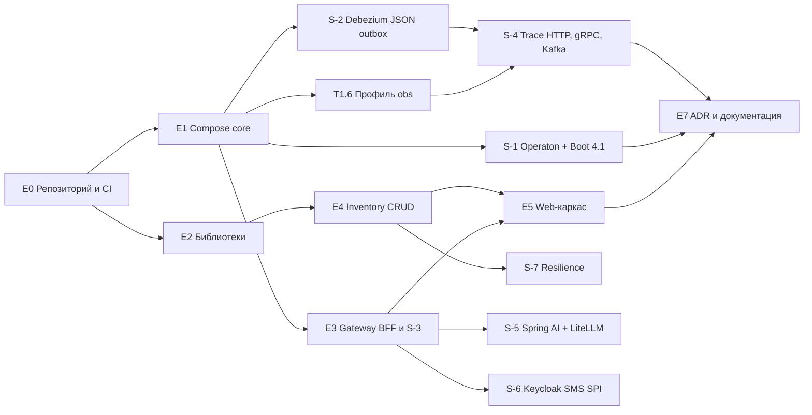

# Smart Rent Hub — План этапа 0 «Основа» v1.0

**Основание:** SDD v1.1 (раздел 15), PRD v3.2 (раздел 11, этап 0)
**Цель этапа:** собрать инженерный фундамент и снять главные технические риски до начала разработки бизнес-логики.
**Результат:** запускаемый локальный стенд с входом, сквозной трассировкой и первым вертикальным срезом (Inventory CRUD), плюс задокументированные результаты spike-экспериментов S-1…S-7.

**Размеры задач (относительные, не календарные):** S — несколько часов; M — один-два дня; L — несколько дней. Сроки зависят от вашей загрузки, поэтому я их не указываю.

---

## 1. Критерии готовности этапа (Definition of Done)

Этап считается завершённым, когда выполнено всё из списка:

- [ ] `docker compose --profile core --profile obs up` поднимает стенд одной командой.
- [ ] Вход клиента (телефон + SMS-код, заглушка) и вход персонала (логин + TOTP) работают через Gateway; браузер получает только cookie сессии.
- [ ] Запрос из браузера доходит через Gateway (TokenRelay) до `inventory`, где проверяются JWT и разрешение `sku:*`.
- [ ] В Jaeger виден **единый trace**: браузер → gateway → inventory → БД. После spike S-4 — также gRPC и Kafka.
- [ ] CRUD по SKU и единицам с `@Version`: два одновременных редактора получают 412 (`VERSION_CONFLICT`), второй не затирает первого. Есть автотест.
- [ ] Загрузка фото в MinIO по pre-signed URL работает.
- [ ] CI на GitHub зелёный: сборка, тесты, ArchUnit, Dependabot и CodeQL включены.
- [ ] Spike S-1…S-7 выполнены, результаты оформлены по шаблону (раздел 6), решения отражены в ADR.
- [ ] README с инструкцией запуска на Windows, документация лежит в `docs/`.

---

## 2. Принципы работы

1. **Trunk-based:** короткие ветки, PR в `main`, обязательный зелёный CI.
2. **Спайк — ограниченный по времени эксперимент.** Лимит на каждый: 1–2 рабочих дня. Если не укладываетесь, зафиксируйте блокер и запасной вариант и идите дальше.
3. **Результат спайка — заметка** `docs/spikes/S-N-название.md` и, если решение изменилось, правка соответствующего ADR.
4. **Вертикальные срезы:** сначала сквозное «тонкое», потом вширь.
5. **Каждая задача:** тесты, обновлённая документация, зелёный CI.

---

## 3. Порядок и зависимости



**Рекомендуемые волны:**

| Волна | Содержание | Зачем в таком порядке |
|---|---|---|
| 1 | E0, T1.1–T1.3, **S-1** | S-1 — самый рискованный спайк (Operaton на Boot 4.1): чем раньше, тем дешевле запасной вариант |
| 2 | Остальное E1, T2.1, E3 (с **S-3**), **S-2** | Основа для всех сервисов; Gateway и Debezium — следующие по риску |
| 3 | E4, E5, T2.2–T2.4, **S-4**, **S-7** | Первый вертикальный срез и трассировка |
| 4 | **S-5**, **S-6**, доработка obs, E7, проверка DoD | Изолированные спайки и документация |

---

## 4. Эпики и задачи

### E0. Репозиторий и инженерная база

| ID | Задача | Размер | Критерий приёмки |
|---|---|---|---|
| T0.1 | Инициализировать монорепо по SDD 3.5: каталоги `contracts`, `libs`, `services`, `tools`, `web`, `infra`, `load-tests`, `docs`; `.gitignore`, `.editorconfig`, `.gitattributes`, README | S | Структура в `main`, README ведёт к `docs/` |
| T0.2 | Maven multi-module: родительский POM и BOM версий (Java 21, Spring Boot 4.1.x, Operaton, Spring AI, Testcontainers), Maven Wrapper | M | `./mvnw verify` проходит на пустых модулях; версии заданы только в BOM |
| T0.3 | Настроить GitHub: защита `main`, шаблоны Issue (task, spike) и PR с чек-листом, labels, milestone «Этап 0», Project board | S | Прямой push в `main` запрещён; шаблоны доступны |
| T0.4 | CI `ci`: сборка и тесты (кэш Maven, фильтры по путям), запуск ArchUnit | M | PR без зелёного CI не вливается |
| T0.5 | Безопасность цепочки поставок: Dependabot (Maven, npm, Docker), CodeQL, secret scanning | S | Конфигурации в `.github/`, первый прогон успешен |
| T0.6 | Форматирование кода (см. вопрос Q1 в разделе 8) и проверка в CI | S | Нарушение форматирования ломает сборку |

### E1. Локальная инфраструктура (Docker Compose)

| ID | Задача | Размер | Критерий приёмки | Статус |
|---|---|---|---|---|
| T1.1 | Compose `core`: PostgreSQL с `wal_level=logical`, init-скрипты (БД и пользователи на сервис: `booking`, `inventory`, `payments`, `risk`, `notification`, `ai`, `finance`, плюс `keycloak`, `litellm`; отдельный пользователь `debezium`) | M | БД созданы, права разделены (владелец схемы и пользователь приложения) | [x] Выполнено |
| T1.2 | Redis и MinIO (инициализация бакетов `handover-photos`, `acts`, `catalog-media`) | S | Бакеты есть, доступ по тестовым ключам | [x] Выполнено |
| T1.3 | Keycloak: realm `smartrent` как код (импорт при старте), клиенты `srh-customer`, `srh-staff`, роли из PRD 3.2, тестовые пользователи | M | Импорт идемпотентен; под тестовыми пользователями получается токен с ролями | [x] Выполнено |
| T1.4 | Kafka (KRaft) + Kafka Connect с Debezium, скрипт регистрации коннекторов | M | Connect отвечает, плагин Debezium загружен | [x] Выполнено |
| T1.5 | Каркас `external-stubs` (Spring Boot, заглушки SMS и банковского ID с управляемыми сценариями) | S | Приложение запускается, SMS «отправляется» в лог и в тестовый эндпойнт | [x] Выполнено |
| T1.6 | Профиль `obs`: OTel Collector, Jaeger, Prometheus, Grafana, Loki, Alloy | L | Дашборды открываются, тестовое приложение видно в Jaeger, метриках и логах | [x] Выполнено |
| T1.7 | Скрипты запуска для Windows (PowerShell): `up`, `down`, `reset`, выбор профилей | S | Команды описаны в README и работают из обычного терминала | |

### E2. Общие библиотеки (`libs`)

| ID | Задача | Размер | Критерий приёмки |
|---|---|---|---|
| T2.1 | `observability-starter`: Micrometer Tracing с мостом OpenTelemetry, JSON-логи с `traceId`, MDC, базовые метрики | M | Любой сервис с зависимостью отдаёт трассы, метрики и логи без настройки |
| T2.2 | `security-starter`: проверка JWT (resource server), каталог «роль → разрешения» из PRD 3.2, `@PreAuthorize`, фильтры SoD-режимов (заглушка), тестовый хелпер токенов | L | Эндпоинт с `hasAuthority('sku:create')` доступен только нужной роли; тесты на все роли из каталога |
| T2.3 | `outbox-starter`: таблицы `outbox` и `processed_event`, публикатор (вставка и удаление в одной транзакции), Inbox для потребителей | M | Интеграционный тест: запись в outbox попадает в WAL; повторное событие отсекается |
| T2.4 | `test-support`: базовые классы Testcontainers (PostgreSQL, Kafka, Redis, MinIO, Keycloak) | M | Один и тот же набор поднимается в тестах двух сервисов |
| T2.5 | `business-calendar` (каркас) | S | Отложена до этапа 2, достаточно интерфейса |

### E3. Gateway как BFF

| ID | Задача | Размер | Критерий приёмки |
|---|---|---|---|
| T3.1 | Каркас `gateway`: маршрутизация на `inventory`, на заглушку Next.js, генерация Trace ID, заголовок `X-Trace-Id` | M | Запрос проходит, trace виден в Jaeger |
| T3.2 | OAuth2-вход через Keycloak (две регистрации), серверная сессия (Spring Session + Redis), TokenRelay, выход | L | Токены в браузере не видны; сервис получает Bearer и проверяет JWT. **Это spike S-3** |
| T3.3 | Защита от CSRF (SameSite, Origin, CSRF-токен), rate limit в Redis | M | Автотесты: запрос без токена и с чужим `Origin` отклоняется |
| T3.4 | WebSocket и SSE по cookie сессии, проверка `Origin` | M | Тестовые эндпоинты (эхо и поток) работают через Gateway |
| T3.5 | `GET /api/v1/session` (роли, имя, срок) | S | Страница входа получает данные сессии |

### E4. Inventory: первый вертикальный срез

| ID | Задача | Размер | Критерий приёмки |
|---|---|---|---|
| T4.1 | Каркас `inventory` (hexagonal: `api`, `app`, `domain`, `infra`), Liquibase, подключение к БД, ArchUnit | M | Сервис стартует, миграции применяются, ArchUnit-правила проходят |
| T4.2 | CRUD по SKU и единицам из Приложения A: `@Version`, `ETag` / `If-Match`, ошибки RFC 9457, пагинация курсором | L | Контрактные тесты; конфликтная правка даёт 412 `VERSION_CONFLICT` |
| T4.3 | Pre-signed URL для загрузки фото в MinIO, таблица `media`, контрольная сумма | M | Загрузка из теста проходит, повторная выдача URL безопасна |
| T4.4 | Разрешения `sku:*`, `unit:*`, `photo:upload` через `security-starter` | S | Роль `CATALOG_EDITOR` может, `CUSTOMER` — нет |
| T4.5 | Автотест lost update: два параллельных редактора одной карточки | S | Второй получает 412, данные первого сохранены |
| T4.6 | События `SkuUpserted` через outbox (на spike S-2 используется как пробный) | S | Событие появляется в топике `inventory.sku.v1` |

### E5. Web-каркас

| ID | Задача | Размер | Критерий приёмки |
|---|---|---|---|
| T5.1 | pnpm workspace, `customer-web` и `staff-web` (Next.js), вызов `/api/v1/session` через Gateway | M | Страницы открываются через единый origin, без CORS |
| T5.2 | Страницы входа и выхода, вывод имени и ролей | S | Оба сценария входа (клиент, персонал) работают |
| T5.3 | `staff-web`: список и карточка SKU (чтение и правка с `If-Match`) | M (необязательная) | Конфликт версий виден пользователю |

### E7. Документация и ADR

| ID | Задача | Размер | Критерий приёмки |
|---|---|---|---|
| T7.1 | Разложить документы в `docs/`, оформить ADR-001…021 отдельными файлами по шаблону | M | Индекс в `docs/adr/README.md` |
| T7.2 | README: требования к рабочей станции, запуск и остановка, профили, решение типовых проблем | S | Новый человек поднимает стенд по README |
| T7.3 | По результатам каждого спайка — заметка и правка ADR | S (на спайк) | См. раздел 6 |

---

## 5. Spike-эксперименты (E6)

Порядок: S-1 → S-3 (внутри T3.2) → S-2 → S-4 → S-7 → S-5 → S-6.

### S-1. Spring Boot 4.1 + Operaton

**Вопрос:** работает ли Operaton на Boot 4.1.x и сохраняет ли атомарность с JPA.

**Шаги:**
1. Модуль `spikes/s1-operaton` на Boot 4.1.x, Operaton 2.1.x, PostgreSQL (Testcontainers).
2. Процесс `checkout-mini`: старт → сервисная задача A (`asyncBefore`, запись JPA) → Event-Based Gateway (сообщение `msg_x` или таймер PT30S) → сервисная задача B → конец.
3. Проверить: (а) job executor выполняет `asyncBefore`; (б) исключение в задаче B откатывает и запись JPA, и переход процесса в одной транзакции; (в) корреляция по business key; (г) гонка: сообщение приходит до коммита шага → `MismatchingMessageCorrelationException`, повтор срабатывает; (д) таймер срабатывает; (е) Java 21, схема `bpm` в отдельной схеме БД; (ж) время старта и память.

**Критерий успеха:** пункты а–д зелёные.
**Если нет:** зафиксировать на Boot 4.0.x (до 31.12.2026) и записать причину; при несовместимости — завести issue в проекте Operaton и обсудить запасной вариант (SDD 16, R1, R2).

### S-3. Gateway как BFF (выполняется в T3.2–T3.4)

**Вопрос:** держит ли Spring Cloud Gateway (релиз-трейн под Boot 4.1) OAuth2-вход, сессию в Redis, TokenRelay, CSRF, WebSocket и SSE по cookie.

**Критерий успеха:** вход через Keycloak, вызов API, WebSocket и SSE работают по одной cookie; токен не виден браузеру; потеря Redis приводит к экрану входа, а не к ошибке.
**Если нет:** зафиксировать версии, проверить совместимость релиз-трейна; запасной вариант — Gateway на Spring Security OAuth2 Client в MVC-варианте или выделенный BFF-сервис (обсудить).

### S-2. Debezium + JSON-outbox

**Шаги:** таблица `outbox` по Приложению A, коннектор из SDD 5.3, вставка и удаление строки в одной транзакции.
**Проверить:** сообщение — обычный JSON без экранирования; заголовки (`event-type`, `event-version`, `correlation-id`, `traceparent`, `occurred-at`) на месте, а заголовок `id` нужен как `event-id`; ключ = `aggregate_id`; порядок внутри ключа; рестарт Connect без потерь и дублей; дубликат отсекает Inbox; рост WAL не бесконтрольный.
**Критерий успеха:** все пункты выполнены на стандартных настройках без кастомных SMT.

### S-4. Сквозная трассировка HTTP → gRPC → Kafka

**Шаги:** три мини-сервиса A → (gRPC) → B → (outbox, Kafka) → C с `observability-starter`.
**Критерий успеха:** один trace в Jaeger через все три границы, `traceparent` присутствует в gRPC-метаданных и в заголовках Kafka.

### S-7. Circuit breaker и повторы

**Вопрос:** что использовать на Boot 4.1: Resilience4j или встроенные возможности Spring Framework 7 (`@Retryable`, `@ConcurrencyLimit`) плюс отдельный circuit breaker.
**Критерий успеха:** выбран вариант, метрики попадают в Prometheus, поведение при открытом breaker покрыто тестом.

### S-5. Spring AI + LiteLLM + Ollama

**Шаги:** профиль `ai` (Ollama с небольшой моделью, LiteLLM по закреплённому digest, не опубликованный наружу, отдельный виртуальный ключ); клиент на Spring AI (`ChatClient`).
**Проверить:** структурированный вывод в Java-record; потоковый ответ (SSE) через Gateway; время до первого токена; поведение при недоступном LiteLLM (rule-based fallback).
**Критерий успеха:** потоковый разбор в record работает. **Если нет:** адаптер на OpenAI Java SDK за тем же портом `LlmProvider`.

### S-6. Keycloak SPI для SMS-кода

**Шаги:** кастомный аутентификатор, отправка кода через `external-stubs`, ограничение попыток, интеграция с realm.
**Критерий успеха:** вход по телефону и коду, повторные попытки блокируются; версия Keycloak и SPI зафиксированы.

---

## 6. Шаблон заметки по спайку (`docs/spikes/S-N-название.md`)

```
# S-N. Название
Дата, версия компонентов (точные).
Вопрос.
Что делали (шаги и ссылки на код/ветку).
Результат по критериям (да/нет, цифры).
Проблемы и обходные пути.
Решение (что принимаем, что меняется в ADR/SDD).
Что остаётся неясным.
```

---

## 7. Рабочая станция (Windows, ориентиры)

| Тема | Рекомендация |
|---|---|
| Docker | Docker Desktop с WSL2-бэкендом |
| Память | Ограничить память WSL2 в `%UserProfile%\.wslconfig` (например `memory=12GB`), профиль `core` + `obs` требует заметных ресурсов; `full` лучше запускать частями |
| Тома | Данные PostgreSQL, Kafka и Elasticsearch держите в **именованных томах** Docker, а не в bind-mount с `D:\` (быстрее и надёжнее) |
| Окончания строк | В `.gitattributes`: `* text=auto`, `*.sh text eol=lf`, `*.ps1 text eol=crlf` |
| Elasticsearch (позже) | В WSL2 нужен `vm.max_map_count=262144` |
| JDK | JDK 21 (любой поддерживаемый дистрибутив), IDE по вашему выбору |

Это общие ориентиры; фактические параметры уточните под свою машину.

---

## 8. Вопросы, которые нужно подтвердить

| № | Вопрос | Моя рекомендация |
|---|---|---|
| Q1 | Форматирование Java-кода | Spotless + google-java-format (проверка в CI) |
| Q2 | Корневой пакет и `groupId` | `com.smartrenthub` (можно заменить на ваш домен) |
| Q3 | Сборка образов (на этапе 1, не 0) | Jib, GHCR (как в SDD 12.3) |
| Q4 | Нужен ли скрипт, который создаст задачи этого плана в GitHub (`gh issue create`) | Да, сделаю по вашему подтверждению; для Windows это PowerShell |
| Q5 | Docker Desktop с WSL2 — ваш вариант? | Да; если другой, скорректирую раздел 7 |

---

## 9. Риски этапа 0

| Риск | Митигация |
|---|---|
| Operaton не работает на Boot 4.1 | S-1 первым; запасной вариант — Boot 4.0.x |
| Ресурсоёмкость стенда | Профили compose, ограничение памяти, `obs` включается по необходимости |
| Расползание спайков | Лимит 1–2 дня, обязательная заметка, переход к следующему |
| Gateway-BFF сложнее ожидаемого | S-3 до начала бизнес-сервисов; запасной вариант в разделе 5 |
| Debezium/Connect: настройка занимает время | Стандартные параметры, JSON-payload, без кастомных SMT |
| Потеря фокуса на «идеальной инфраструктуре» | Критерии DoD: нужен вертикальный срез, а не полный набор |

---

## 10. Первый день (чек-лист)

1. Инициализировать репозиторий и структуру каталогов (T0.1), перенести документы в `docs/`.
2. Настроить GitHub: защита `main`, шаблоны, labels, milestone (T0.3).
3. Создать родительский POM и BOM (T0.2), убедиться, что `./mvnw verify` проходит.
4. Поднять Compose с PostgreSQL, Redis, MinIO (T1.1, T1.2).
5. Создать модуль `spikes/s1-operaton` и запустить первый вариант процесса (S-1).
