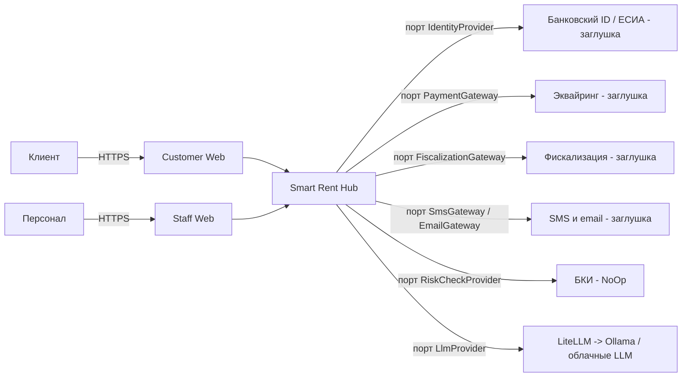
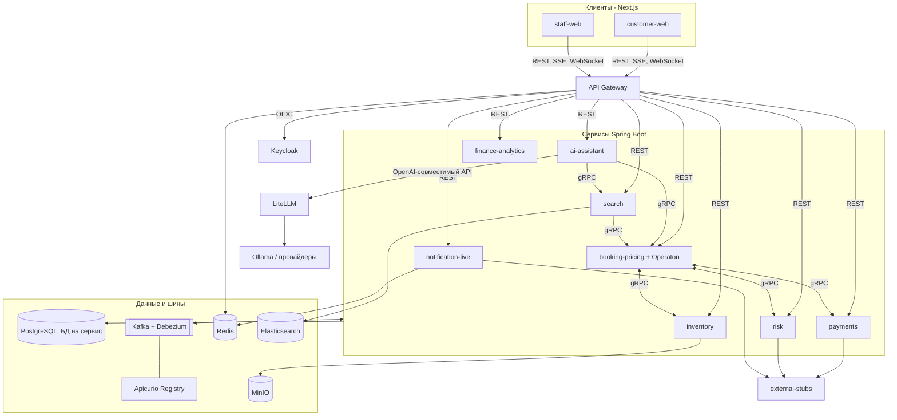
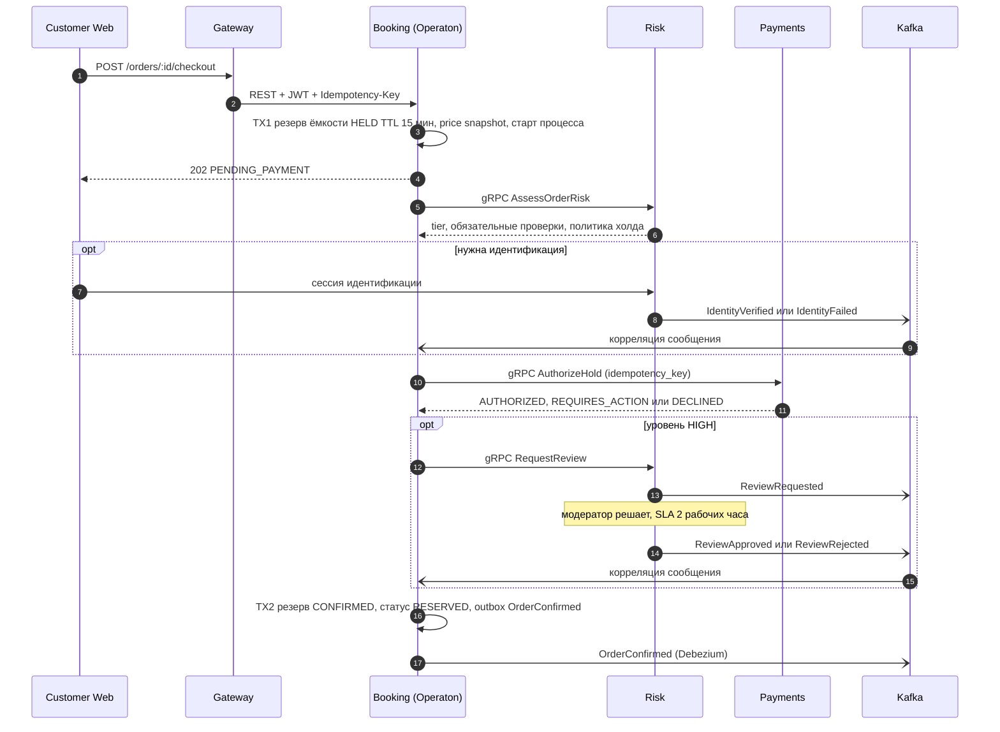
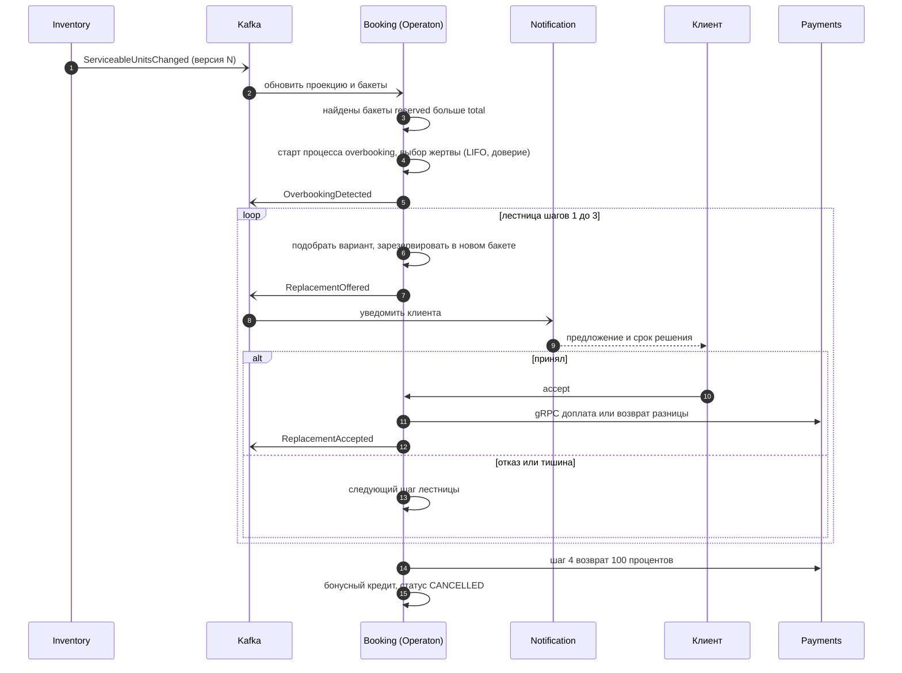
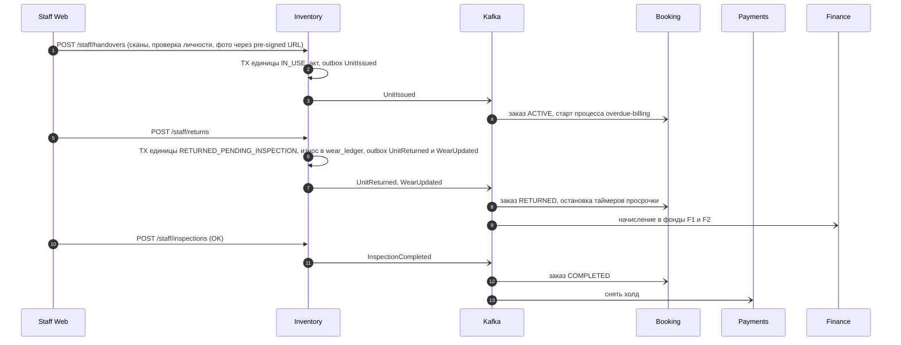
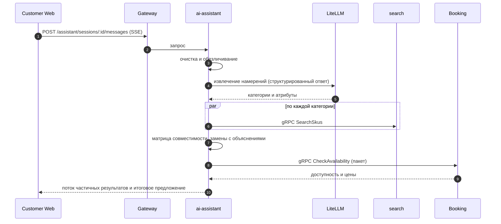

# Smart Rent Hub — System Design Document (SDD) v1.0

**Основание:** PRD v3.1 (утверждён)
**Статус:** Draft для ревью
**Аудитория:** Tech Lead, архитекторы, Backend Team, DevOps
**Приложения:** A — модель данных; B — каталог API (REST и gRPC); C — каталог событий

**Условные обозначения**

- `[ПРИНЯТО]` — решение владельца продукта.
- `[ПРЕДЛОЖЕНО]` — моё решение по умолчанию, можно оспорить (статус каждого решения в журнале ADR, раздел 14).
- `[ТРЕБУЕТ РЕШЕНИЯ]` — выбор инструмента, который нужно подтвердить до старта разработки.
- `[SPIKE]` — проверяется экспериментом на этапе 0 (раздел 15).
- `CFG` — конфигурируемый параметр (как в PRD).

---

## 1. Введение

### 1.1. Цель и область

Документ описывает, **как** устроена система, реализующая PRD v3.1: сервисы и их границы, данные, взаимодействия, согласованность, безопасность, наблюдаемость, развёртывание и тестирование. Область: backend, инфраструктура, интеграционные контракты с веб-клиентами. Вёрстка и UX веб-клиентов — вне области (описаны только архитектура и контракты).

### 1.2. Трассируемость к PRD

| PRD | Где в SDD |
|---|---|
| 2 (стек), 2.2 (принципы) | 2, 3, 5.3, 14 |
| 3 (роли, SoD) | 9.2–9.4 |
| 5.1–5.3 (каталог, бронирование, цена) | 4.2, 4.3, 8.1–8.3 |
| 5.4, 5.12 (износ, финансы) | 4.3, 4.9, 6.3 |
| 5.5 (риск, защита) | 4.5, 6.1 |
| 5.6–5.7 (выдача, возврат, просрочка) | 6.3, 7 |
| 5.8 (овербукинг) | 6.2, 7 |
| 5.9–5.11 (споры, отмены, статусы) | 4.2, 4.3, Приложение A |
| 6 (сервисы), 7 (события), 8 (интеграции) | 4, Приложения B и C |
| 9 (NFR) | 8, 10, 11, 13 |
| 11 (этапы) | 15 |

### 1.3. Изменения, которые SDD вносит в PRD (подготовлю PRD v3.2 после вашего подтверждения)

1. **Spring Boot 3 → 4.x** (раздел 2.2): ветка 3.x вышла из OSS-поддержки.
2. Стек дополняется: gRPC для внутренних вызовов, Operaton (форк Camunda 7) для BPMN, LiteLLM для AI, Apicurio Registry, Next.js.
3. Сервис Search получает имя `search-service` (консьюмер + API запросов), добавляется вспомогательное приложение `external-stubs` (заглушки внешних систем).
4. Статус `MAINTENANCE` получает тип: `ROUTINE_CLEANING` (штатная чистка, единица считается обслуживаемой) и `TECHNICAL_SERVICE` (обязательное ТО, единица исключается из ёмкости). Без этого каждый возврат менял бы ёмкость и вызывал ложные овербукинги.
5. Каталог событий дополняется: `IdentityVerified`, `IdentityFailed`, `SkuUpserted`, `ConfigChanged`; согласования SoD выделены в топик `platform.approval.v1`.
6. Корзина — это заказ в статусе `DRAFT` (хранится в Booking). Горизонт бронирования ограничен `CFG` 180 суток.
7. Из-за упрощения v1 (ёмкость не зависит от даты возврата ремонта) см. ограничение L1 в разделе 16.

---

## 2. Архитектурные драйверы

### 2.1. Приоритеты качественных атрибутов

1. **Корректность:** ноль овербукинга, ни одной потерянной или задвоенной денежной операции.
2. **Наблюдаемость и тестируемость** (учебная цель проекта).
3. **Устойчивость** к отказам внешних систем.
4. **Производительность** (цели из PRD 9.1).
5. **Экономия ресурсов** (проект запускается на одной машине).

| Драйвер (PRD) | Архитектурное решение |
|---|---|
| Нулевой овербукинг | Посуточные бакеты ёмкости + условное атомарное обновление (8.1) |
| Распределённая сага оформления | Operaton (BPMN), Outbox, идемпотентность (7, 8.4) |
| Учебные цели (CDC, Kafka, gRPC, BPMN, ES, WebSocket) | Микросервисы, Debezium + Kafka, gRPC внутри, REST снаружи |
| Данные в РФ, минимизация ПДн | Локальная инфраструктура, обезличивание перед LLM, сканы паспортов не хранятся |
| Конфигурируемость (`CFG`) | Таблицы конфигурации сервиса-владельца + событие `ConfigChanged` |
| Внешние системы — заглушки | Порты (hexagonal) + приложение `external-stubs` |
| Совмещение ролей, SoD | Роли Keycloak → разрешения в общей библиотеке, согласования через события (9.2–9.4) |
| Финансовый учёт парка | Событийная проекция в Finance & Analytics |

### 2.2. Базовые версии `[ПРЕДЛОЖЕНО]`

| Компонент | Выбор | Основание |
|---|---|---|
| Java | 21 LTS `[ПРИНЯТО]` | Operaton поддерживает 17, 21, 25; baseline Spring Boot 4 — Java 17 |
| Spring Boot | **4.1.x** `[ТРЕБУЕТ РЕШЕНИЯ]` | Все ветки 3.x вне OSS-поддержки (3.5 — с 30.06.2026); 4.0 поддерживается до 31.12.2026; 4.1 вышел 10.06.2026 и содержит встроенную поддержку gRPC |
| Spring Cloud | Релиз-трейн под Boot 4.1 | `[SPIKE]` совместимость Gateway |
| Operaton | 2.1.x | Форк Camunda 7, совместим с моделями и API Camunda 7.24; `[SPIKE]` совместимость с Boot 4.1 |
| LiteLLM | не ниже 1.96.2, образ по digest | Исправлена уязвимость подмены outbound-вызова и учтены компрометированные версии 1.82.7 и 1.82.8 (9.6) |
| Kafka | Актуальная стабильная, режим KRaft | Без ZooKeeper |
| PostgreSQL, Elasticsearch, Keycloak, Redis, MinIO, Debezium, Apicurio | Актуальные стабильные версии | Фиксируются в BOM/compose на этапе 0 |
| Next.js | Актуальная стабильная | Ваш опыт |

> **Важно про Camunda 7.** Community Edition завершила жизненный цикл в октябре 2025 (последний релиз 7.24). Operaton — прямой преемник: тот же BPMN/DMN, те же Java API и схема БД, поэтому навыки Camunda 7 остаются применимыми. Альтернативы: Camunda 7 Enterprise (платная) или Camunda 8 (другая архитектура, внешний кластер Zeebe). См. ADR-007.

---

## 3. Обзор архитектуры

### 3.1. Контекст системы



### 3.2. Контейнеры



### 3.3. Деплоимые единицы

| Единица | Ответственность | БД | gRPC-сервер | Публикует (топики) | Подписан |
|---|---|---|---|---|---|
| `gateway` | Маршрутизация, JWT, rate limit, Trace ID, WebSocket/SSE | — | — | — | — |
| `booking-pricing` | Ёмкость, цена, заказы, саги (Operaton), овербукинг, просрочка | `booking` | Availability, Pricing, Approvals | `booking.*` | `inventory.*`, `payments.*`, `risk.*`, `platform.approval.v1` |
| `inventory` | Каталог, единицы, паспорт, выдача и возврат, инспекции, претензии, износ | `inventory` | Inventory, Approvals | `inventory.*` | `booking.order.v1` |
| `payments` | Холды, списания, возвраты, переавторизация | `payments` | Payments | `payments.payment.v1` | `inventory.handover.v1`, `booking.order.v1` |
| `risk` | Уровни риска, доверие, идентификация, модерация, чёрный список | `risk` | Risk, Approvals | `risk.*` | `booking.order.v1`, `payments.payment.v1`, `inventory.handover.v1` |
| `notification-live` | SMS/email, WebSocket, инбокс задач персонала, согласования | `notification` | — | — | почти все топики |
| `ai-assistant` | AI-подбор, матрица совместимости | `ai` | — | — | `inventory.sku.v1` |
| `search` | Индексация ES, API поиска | — (ES) | Search | — | `inventory.sku.v1`, `booking.tariff.v1` |
| `finance-analytics` | Журнал фондов, амортизация, отчёты | `finance` | — | — | `inventory.unit.v1`, `booking.order.v1`, `inventory.handover.v1`, `payments.payment.v1` |

Вспомогательное приложение `external-stubs` реализует заглушки внешних систем (банковский ID, эквайринг, фискализация, SMS/email, БКИ) с управляемыми сценариями: успех, отказ, нехватка средств, таймаут, 3DS.

### 3.4. Правила взаимодействия

1. **Снаружи:** REST + OpenAPI (через Gateway), потоки AI — SSE, дашборд склада — WebSocket.
2. **Между сервисами:** синхронные запросы с немедленным ответом — gRPC; факты о случившемся — события Kafka.
3. На горячем пути бронирования **не более одного синхронного хопа** после проверки доступности.
4. Каждый сервис владеет своей БД; прямых чтений чужих БД нет.
5. Запись в БД и публикация события — только через **Outbox** (5.3).
6. Источник правды по доступности — Booking. Elasticsearch доступность не определяет.

### 3.5. Структура монорепозитория

```
smart-rent-hub/
├─ contracts/        proto/, avro/, openapi/
├─ libs/             security-starter, outbox-starter, observability-starter,
│                    business-calendar, test-support
├─ services/         gateway, booking-pricing, inventory, payments, risk,
│                    notification-live, ai-assistant, search, finance-analytics
├─ tools/            external-stubs
├─ web/              customer-web, staff-web   (pnpm workspace)
├─ infra/            compose/, helm/, keycloak/, debezium/, litellm/, grafana/, otel/
├─ load-tests/       k6
└─ docs/             prd/, sdd/, adr/
```

Сборка: Maven multi-module, общий BOM версий. Контракты (`.proto`, Avro, OpenAPI) лежат отдельным модулем, генерируемые клиенты и DTO собираются из них.

---

## 4. Сервисы

Внутренняя структура каждого сервиса одинакова (hexagonal): `api` (REST/gRPC контроллеры), `app` (сценарии использования), `domain` (правила без зависимостей), `infra` (JPA, Kafka, gRPC-клиенты, адаптеры портов). Границы слоёв проверяются ArchUnit.

### 4.1. gateway

- Spring Cloud Gateway (реактивный вариант, для WebSocket и SSE).
- Проверка JWT (JWKS Keycloak), грубая авторизация по префиксам (`/api/v1/staff/**` — только персонал), rate limit в Redis (по пользователю и IP, `CFG`), лимиты размера запроса, CORS.
- **Trace ID:** принимает или создаёт `traceparent`, возвращает `X-Trace-Id`.
- WebSocket: браузер не может передать заголовок `Authorization`, поэтому клиент получает краткоживущий **тикет** (`POST /api/v1/ws-ticket`, TTL 30 с, одноразовый, хранится в Redis) и подключается как `/ws/staff?ticket=…`.
- Передаёт заголовок `Idempotency-Key` без изменений.

### 4.2. booking-pricing

Модули: `catalog-ref` (проекции SKU и тарифов), `capacity`, `pricing`, `orders`, `checkout` (процесс), `overbooking`, `billing` (просрочка), `assignment`, `availability-api`.

| Тема | Решение |
|---|---|
| Ёмкость | Таблица посуточных бакетов (`sku, grade, day`), см. 8.1 |
| Проекция обслуживаемых единиц | Таблица `serviceable_units`, обновляется событиями `ServiceableUnitsChanged` (8.3) |
| Цена | `PriceCalculator` — чистая детерминированная функция (тариф, позиция, даты, грейд, загрузка по дням) → раскладка. Загрузка категории считается агрегатом по бакетам (`category_id` хранится в бакете) |
| Price snapshot | JSONB в заказе, неизменяем после подтверждения (PRD 5.3.5) |
| Корзина | Заказ `DRAFT`; ёмкость не держит |
| Назначение единиц | Задание db-scheduler раз в 15 мин: заказы `RESERVED` с выдачей через ≤ 24 ч → gRPC `Inventory.AssignUnits`; при нехватке — запуск процесса `overbooking` |
| Статусы | Конечный автомат заказа и позиций в коде, переходы фиксируются в `order_status_history` (с `acted_under_permission`) |
| Овербукинг | Обнаружение при пересчёте бакетов; решение — процесс `overbooking` (7) |
| Бонусный кредит | Таблица `bonus_credit`, применяется как способ оплаты |
| Эндпоинты | Приложение B |

### 4.3. inventory

Модули: `catalog`, `units` (цифровой паспорт), `kits`, `consumables`, `handover`, `inspection`, `claims`, `media`, `wear`, `pickup-config` (часы работы, слоты, праздники — владелец календаря пункта выдачи).

- **Оптимистичные блокировки** (`@Version`) на карточках SKU, единиц, комплектов.
- **AssignUnits:** выбирает единицы `AVAILABLE` нужного SKU и грейда, сортировка по `total_wear_days` по возрастанию, `FOR UPDATE SKIP LOCKED`, помечает `ASSIGNED`. Возвращает назначенные единицы и недостачу.
- **Износ:** при приёме возврата считает фактические сутки (округление вверх, минимум 1), применяет ×1.2 при > 7 суток, пишет в `wear_ledger` (уникально по `order_id, unit_id`) и публикует `WearUpdated`. Пересечение порогов 50 и 100 меняет грейд и статус.
- **Финансовые атрибуты паспорта** (PRD 5.12.3) хранятся здесь, источник данных для Finance.
- **Файлы:** фото и акты — в MinIO; клиент получает pre-signed URL (TTL 5 мин `CFG`), загрузка идёт напрямую в MinIO, Inventory хранит только ключи объектов и контрольные суммы.
- **Календарь пункта выдачи** отдаётся другим сервисам библиотекой `business-calendar` по проекции конфигурации (событие `ConfigChanged`).
- **Претензии:** конечный автомат `OPENED → ASSESSED → CLIENT_RESPONSE → RESOLVED`; в v1 без BPMN (возможное расширение).

### 4.4. payments

- Порт `PaymentGateway`; заглушка реализует сценарии токенами (`ok`, `decline`, `insufficient`, `timeout`, `3ds`).
- Сущности: `payment_method` (токен и последние 4 цифры), `hold`, `payment` (операция), `debt`.
- **Каждая операция идемпотентна** по `idempotency_key` (уникальный индекс). При таймауте клиент **сначала** вызывает `GetPaymentStatus`, а не повторяет операцию вслепую.
- Задания: переавторизация длинных холдов (срок жизни холда `CFG` 7 суток), снятие холда через 72 часа после возврата, повтор неуспешных фискальных чеков.
- Слушает `InspectionCompleted` (снять холд) и `OrderOverdue` (штраф) через gRPC от Booking.

### 4.5. risk

- Чистые доменные правила уровня риска (PRD 5.5.1) и уровней доверия (PRD 5.5.4), параметры из `CFG`.
- Порты `IdentityProvider` и `RiskCheckProvider` (БКИ — NoOp).
- Сущности: `customer_profile` (уровень доверия, счётчики, штрафные периоды), `identity_verification` (только результат проверки и метка времени), `review_task`, `blacklist_entry`.
- Очередь модерации: задача, SLA `CFG` 2 рабочих часа, эскалация.
- Публикует `UserBlocked` → интеграция с Keycloak через административный API (учётная запись блокируется).

### 4.6. notification-live

- Шаблоны уведомлений, каналы SMS/email (порты), политика повторов; критичные уведомления (овербукинг) уходят в несколько каналов.
- **Инбокс задач персонала** (`staff_task`): задачи сборки, модерации, эскалации, согласования SoD. Задача видна всем, у кого есть нужное разрешение.
- **WebSocket:** чистый WebSocket (Spring) + Redis Pub/Sub для рассылки между инстансами. Источник правды — БД. При переподключении клиент передаёт `lastEventId`, сервер дозаполняет пропущенное.
- **Согласования:** слушает `ApprovalRequested`, показывает задачу; решение пользователя отправляет gRPC-вызовом в сервис-владелец (`Approvals.Decide`).

### 4.7. ai-assistant

Конвейер (6.4): очистка → извлечение намерений LLM → поиск кандидатов → матрица совместимости → доступность → сборка предложения.

- **LLM никогда не возвращает идентификаторы и цены**: только категории и атрибуты; корзина собирается из каталога.
- Порт `LlmProvider`, основной адаптер — OpenAI-совместимый клиент к LiteLLM (9.6); при открытом circuit breaker срабатывает правило-based fallback (сопоставление ключевых слов с категориями).
- **Матрица совместимости** хранится в PostgreSQL: атрибуты SKU (`mount`, `power`, `connector`, `sync`) + правила (`compat_rule`) + рёбра (`compat_edge`). Движок детерминированный, объясняет каждую замену.
- Параллельность: виртуальные потоки (`Executors.newVirtualThreadPerTaskExecutor()`) и `CompletableFuture` с бюджетом времени на шаг; общий таймаут `CFG` 8 с.
- Контекст сессии — в Redis (TTL), без персональных данных.

### 4.8. search

- Консьюмер `inventory.sku.v1` (compacted) и `booking.tariff.v1`, индекс `sku-v1` (алиас `sku`).
- Анализаторы: русская морфология, транслитерация (ICU), словарь синонимов («синхайзер» → Sennheiser), fuzziness `AUTO`, edge-ngram для подсказок.
- **Переиндексация:** новый индекс + пересборка из Kafka + смена алиаса.
- API поиска возвращает результаты и **обогащает** их флагом доступности и ценой «от» через пакетный gRPC `Availability.CheckAvailability` (результат кэшируется в Redis на 10 с).
- Словарь синонимов редактирует `CONTENT_MANAGER` через REST.

### 4.9. finance-analytics

- Подписки на события износа, заказов, ремонтов, претензий, закупки и выбытия единиц.
- Журнал фондов F1–F3 append-only, идемпотентность по `source_event_id` (уникальный индекс), полный пересчёт из событий (replay).
- Задание ежемесячного закрытия (db-scheduler): календарный минимум амортизации, остатки фондов.
- Отчёты: PostgreSQL + дашборды Grafana; экспорт CSV для бухгалтера.

---

## 5. Данные

### 5.1. Принципы

- БД на сервис, миграции Liquibase (changelog в репозитории сервиса).
- Идентификаторы — UUIDv7 (упорядочены по времени, меньше фрагментации индексов).
- Время — `timestamptz` в UTC; даты суточной ёмкости — `date` в `Europe/Moscow`.
- Деньги — `numeric(12,2)`, валюта RUB (константа в v1).
- Конкурентность: `@Version` в Inventory, условные обновления в Booking.
- Полная схема ключевых таблиц — Приложение A.

### 5.2. Размещение PostgreSQL

Один кластер, отдельная БД и отдельный пользователь на сервис (`booking`, `inventory`, `payments`, `risk`, `notification`, `ai`, `finance`, плюс БД для Keycloak, LiteLLM и Apicurio). Условия для Debezium: `wal_level=logical`, `max_replication_slots` и `max_wal_senders` с запасом, отдельный пользователь `debezium` с правом репликации, слот и публикация на каждую БД с outbox. Мониторинг размера WAL обязателен (брошенный слот блокирует очистку WAL).

### 5.3. Outbox и Inbox

**Outbox.** Таблица `outbox` в каждой БД: `id`, `aggregate_type` (имя топика, например `booking.order.v1`), `aggregate_id` (ключ партиции), `event_type`, `payload` (Avro-байты в формате Apicurio), `headers` (JSONB), `created_at`. Приложение вставляет строку в той же транзакции, что и изменение данных, и удаляет её в той же транзакции (Debezium читает вставку из WAL). Коннектор Debezium с `EventRouter` публикует байты в топик из `aggregate_type`; значение передаётся `ByteArrayConverter`, а Apicurio-десериализаторы потребителей читают схему из заголовка байтов. `[SPIKE]` S-2.

Пример коннектора (параметры уточнить на spike):

```json
{
  "name": "booking-outbox",
  "config": {
    "connector.class": "io.debezium.connector.postgresql.PostgresConnector",
    "plugin.name": "pgoutput",
    "database.hostname": "postgres",
    "database.dbname": "booking",
    "topic.prefix": "booking",
    "slot.name": "booking_outbox_slot",
    "publication.name": "booking_outbox_pub",
    "table.include.list": "public.outbox",
    "tombstones.on.delete": "false",
    "key.converter": "org.apache.kafka.connect.storage.StringConverter",
    "value.converter": "org.apache.kafka.connect.converters.ByteArrayConverter",
    "transforms": "outbox",
    "transforms.outbox.type": "io.debezium.transforms.outbox.EventRouter",
    "transforms.outbox.table.field.event.id": "id",
    "transforms.outbox.table.field.event.key": "aggregate_id",
    "transforms.outbox.table.field.event.payload": "payload",
    "transforms.outbox.route.by.field": "aggregate_type",
    "transforms.outbox.route.topic.replacement": "${routedByValue}",
    "transforms.outbox.table.fields.additional.placement": "event_type:header:event-type"
  }
}
```

**Inbox.** Таблица `processed_event (consumer, event_id)` с уникальным ключом. Консьюмер в одной транзакции вставляет запись и применяет изменения; дубликат ловится нарушением уникальности и пропускается.

### 5.4. Elasticsearch

Индекс `sku-v1` (алиас `sku`): `sku_id`, `name`, `brand`, `model`, `category_path`, `attributes`, `price_from`, `updated_at`. Поля имени — мультиполя: морфология (`ru_morph`), транслитерация (`translit`), `edge_ngram`. Данные об остатках в индексе **не хранятся**.

### 5.5. Redis

| Назначение | Сервис | Ключи и TTL |
|---|---|---|
| Rate limit | gateway | токен-бакеты, TTL по окну |
| Тикеты WebSocket | gateway | `ws-ticket:<id>`, 30 с |
| Кэш доступности | search, booking | `avail:<sku>:<from>:<to>`, 10 с |
| Контекст AI-сессии | ai-assistant | `ai-session:<id>`, `CFG` 30 мин |
| Pub/Sub для WebSocket | notification-live | канал на инстанс |
| Распределённый lock (только эксперимент, 8.2) | booking | `lock:cap:<sku>:<grade>` |

### 5.6. MinIO

Бакеты: `handover-photos` (ключ `{orderId}/{handoverId}/{type}-{n}.jpg`), `acts` (PDF актов и договоров), `catalog-media`. Серверное шифрование, версионирование включено для `acts`. Доступ только по pre-signed URL; клиенту — только к собственным заказам.

### 5.7. Конфигурация (`CFG`)

Таблица `app_config (key, value, version, updated_by, updated_at)` в БД сервиса-владельца параметра. Изменения аудируются, публикуется `ConfigChanged`; сервисы кэшируют значения и сбрасывают кэш по событию. Значения по умолчанию лежат в `application.yml`.

---

## 6. Ключевые взаимодействия

### 6.1. Оформление заказа (сага `checkout`)



**Компенсации.** Истечение TTL, отказ идентификации, отклонение платежа или модерации → освободить ёмкость (`HELD → RELEASED`), снять холд (`Payments.ReleaseHold`), статус `EXPIRED` или `CANCELLED`, событие и уведомление.

**Отказы по шагам:**

| Шаг | Сбой | Поведение |
|---|---|---|
| Резерв | Нет ёмкости | 409 `CAPACITY_UNAVAILABLE`, альтернативные даты |
| Risk | Недоступен | Повторы по BPMN (3 раза, 10 с, 1 мин, 5 мин), затем инцидент, алерт; клиент видит «обрабатывается», TTL продолжает идти |
| Payments, таймаут | Неизвестное состояние | Сначала `GetPaymentStatus` по ключу идемпотентности, потом решение; слепой повтор запрещён |
| TX2 откатилась после успеха Payments | Рассинхрон | Повтор шага безопасен (идемпотентный вызов), инцидент при исчерпании |
| Потерян процесс | Резерв «висит» | Подстраховка: задание-уборщик раз в минуту освобождает `HELD` с истёкшим `expires_at` |

### 6.2. Овербукинг



Правило вытеснения, лестница и компенсация — PRD 5.8. Резервы нового варианта удерживаются на время ожидания решения (`HELD` с TTL `CFG`); при истечении освобождаются.

### 6.3. Выдача, возврат, износ, финансы



### 6.4. AI-подбор



Бюджет времени и fallback — 11.

### 6.5. Согласование SoD

1. Сервис-владелец встречает чувствительное действие (PRD 3.4), определяет режим (`BLOCK`, `SECOND_APPROVER`, `LOG_ONLY`) и количество пользователей с разрешением.
2. `SECOND_APPROVER`: создаёт `approval_request`, публикует `ApprovalRequested`.
3. Notification кладёт задачу в инбокс. Второй пользователь решает; Notification вызывает `Approvals.Decide` у сервиса-владельца.
4. Сервис-владелец **сам проверяет** (не Notification): решающий ≠ инициатор, наличие разрешения; затем выполняет действие и пишет аудит.
5. `LOG_ONLY` (недостаточно пользователей): действие выполняется сразу, помечается флагом, комментарий обязателен, алерт владельцу, строка в ежедневном отчёте.

---

## 7. BPMN-процессы (Operaton)

**Размещение.** Движок встроен в `booking-pricing`, использует **тот же DataSource и менеджер транзакций**, поэтому шаг процесса, изменение данных и запись в outbox атомарны. Таблицы движка — схема `bpm` в БД `booking`. Модели лежат в `src/main/resources/bpmn`. `[ТРЕБУЕТ РЕШЕНИЯ]` ADR-007.

**Правило выбора таймеров:** таймеры, принадлежащие одному экземпляру бизнес-процесса, — BPMN-события; периодические пакетные задания — db-scheduler (ADR-010).

| Процесс | Ключ | Старт | Шаги | Таймеры | Сообщения | Компенсации |
|---|---|---|---|---|---|---|
| Оформление заказа | `checkout` | `POST …/checkout` | Резерв → риск → идентификация → авторизация холда → модерация → подтверждение | TTL 15 мин до авторизации; SLA модерации 2 раб. ч (эскалация) | `IdentityVerified/Failed`, `PaymentAuthorized/Failed`, `ReviewApproved/Rejected` | Освободить ёмкость, снять холд, `EXPIRED` или `CANCELLED` |
| Разрешение овербукинга | `overbooking` | `OverbookingDetected`, нехватка при назначении, риск каскада просрочки | Выбор жертвы → лестница 1–3 → шаг 4 | Срок решения клиента (6 ч, но не позднее чем за 4 ч до выдачи) | `ReplacementAccepted/Declined` | Освободить резерв замены, возврат, бонус |
| Контроль выдачи | `pickup-watch` | Заказ `RESERVED` | Ожидание выдачи | Начало слота + 2 ч → `NO_SHOW` | `UnitIssued` | Освободить ёмкость, удержание 50% первых суток |
| Просрочка и биллинг | `overdue-billing` | Заказ `ACTIVE` | Ожидание возврата → штраф 50% (2–12 ч) → полные сутки → эскалации (24 и 72 ч) | Срок возврата + 2 ч, + 12 ч, суточные | `UnitReturned` (прерывает) | — |

**Правила моделирования.**

- Переменные процесса — только идентификаторы и небольшие флаги; данные берутся из БД.
- Каждый сервисный шаг с удалённым вызовом: `asyncBefore`, повторы по расписанию (`R3/PT10S` и далее по возрастающей), идемпотентные вызовы с ключом `<orderId>:<шаг>:<попытка>`.
- Бизнес-ошибки — `BpmnError` с обработкой в модели; технические — инцидент с алертом.
- История: уровень `audit` `CFG`, автоочистка по TTL (90 суток `CFG`).
- Версионирование: новая версия модели не меняет запущенные экземпляры; миграции экземпляров — отдельная процедура.
- Cockpit включён только в dev и stage, не публикуется через Gateway.
- Движок изолирован в модуле `checkout` / `overbooking` / `billing` за интерфейсами: доменная логика не зависит от API движка.

---

## 8. Конкурентность и согласованность

### 8.1. Резерв ёмкости `[ПРИНЯТО]`

Основной вариант: посуточные бакеты и условное атомарное обновление.

```sql
-- одна транзакция, READ COMMITTED
-- 1. блокировка строк в детерминированном порядке (против взаимных блокировок);
--    для нескольких позиций заказа порядок сквозной: (sku_id, grade, day)
SELECT 1 FROM capacity_bucket
 WHERE sku_id = :sku AND grade = :grade AND day BETWEEN :from AND :to
 ORDER BY sku_id, grade, day
 FOR UPDATE;

-- 2. условное увеличение: сработает только там, где остаётся место
UPDATE capacity_bucket
   SET reserved_units = reserved_units + :qty
 WHERE sku_id = :sku AND grade = :grade AND day BETWEEN :from AND :to
   AND reserved_units + :qty <= total_units;

-- 3. если затронуто строк меньше числа суток занятости -> ROLLBACK, 409 CAPACITY_UNAVAILABLE
```

- Дни занятости вычисляет доменная функция `occupancyDays` (учитывает `same_day_turnaround`).
- Освобождение: `reservation.status HELD → RELEASED` и уменьшение `reserved_units` в одной транзакции; повторный вызов не меняет данные (идемпотентно по статусу).
- Бакеты материализуются на горизонт `CFG` 180 суток; ежедневное задание добавляет новые дни. Бронь за горизонтом запрещена.
- Ограничения `CHECK (reserved_units <= total_units)` нет намеренно: при уменьшении `total_units` (поломка) допускается `reserved > total`, это и есть признак овербукинга. Инвариант на **рост** `reserved_units` обеспечивает условное обновление.

### 8.2. Альтернативы и план эксперимента `[ПРИНЯТО]`

| Вариант | Суть | Ожидание |
|---|---|---|
| A (основной) | Блокировка строк по порядку + условный UPDATE | Простота, корректность, чуть выше задержки на «горячей» SKU |
| B | Пессимистичная блокировка агрегата SKU (`SELECT FOR UPDATE` на строке-счётчике) | Максимальная корректность, хуже параллелизм |
| C | Redisson-лок на `(sku, grade)` + обновление БД | Снижение конфликтов в БД, но новая точка отказа |
| D | Оптимистичный `version` с повторами | Много повторов при конкуренции за последнюю единицу |

Нагрузочные сценарии k6: (1) 200 параллельных запросов на последнюю единицу — ровно один успех; (2) «горячая» SKU, смешанная нагрузка чтения и записи; (3) заказы с несколькими позициями (контроль взаимных блокировок). Метрики: p50/p95/p99, число отказов, повторов, взаимных блокировок, использование CPU БД. Критерий приёмки — PRD 9.1 (0 овербукингов).

### 8.3. Проекция обслуживаемых единиц

- `ServiceableUnitsChanged` содержит **абсолютное** число по `(sku, grade)` и монотонную версию. Booking применяет событие, только если версия выше сохранённой (устойчиво к дубликатам и перестановке).
- Обслуживаемые единицы — не `IN_REPAIR`, не `MAINTENANCE` типа `TECHNICAL_SERVICE`, не `DECOMMISSIONED`, не `LOST`. Штатная чистка единицу не исключает.
- После применения обновляется `total_units` для дат от текущей и далее; бакеты с `reserved > total` запускают овербукинг.
- **Сверка:** ежедневное задание сравнивает проекцию с `Inventory.GetServiceableCounts`, расхождение — алерт и автокоррекция.
- Ограничение L1 (раздел 16): в v1 снижение ёмкости действует на все будущие даты до восстановления единицы (консервативно).

### 8.4. Идемпотентность

| Уровень | Механизм |
|---|---|
| REST | `Idempotency-Key` + таблица `idempotency_key` (хэш запроса, сохранённый ответ), повтор с другим телом — 422 |
| gRPC | Поле `idempotency_key` в запросах записи; повтор возвращает исходный результат (`ALREADY_EXISTS` не используется как ошибка) |
| Kafka | Inbox (5.3) |
| Износ | `wear_ledger` уникален по `(order_id, unit_id)` |
| Платежи | `idempotency_key` уникален в `payment` и `hold` |
| Финансы | `source_event_id` уникален в журнале |
| Задания | Обработка заказа проверяет текущий статус, а не только факт срабатывания |

### 8.5. Порядок и доставка событий

Ключ партиции — идентификатор агрегата, внутри ключа порядок сохраняется. Доставка at-least-once; потребители идемпотентны. События, не зависящие от порядка (счётчики), несут версию. Недоставленные после повторов уходят в DLT и вызывают алерт.

### 8.6. Инварианты и способ гарантии

| Инвариант | Как гарантируется |
|---|---|
| Резервов не больше ёмкости | Условное обновление (8.1) |
| Резерв не живёт дольше TTL без подтверждения | BPMN-таймер + задание-уборщик |
| Один заказ — один холд на попытку | Уникальность `idempotency_key` |
| Износ начисляется ровно один раз | `wear_ledger` |
| Нет потерянных событий | Outbox в той же транзакции |
| Изменение карточки не затирает чужое | `@Version` (Inventory) |
| Журнал фондов не меняется задним числом | Append-only, права на таблицу без `UPDATE/DELETE` |

---

## 9. Безопасность

### 9.1. Аутентификация

- Keycloak, realm `smartrent`; клиенты `customer-web` и `staff-web` (OIDC, authorization code + PKCE) и сервисные клиенты.
- **Вход клиента: телефон + SMS-код** — кастомный аутентификатор Keycloak (SPI), отправляющий код через порт `SmsGateway`. Персонал: логин/пароль + TOTP. `[SPIKE]` S-6.
- Next.js работает как BFF: токены хранятся на сервере (httpOnly-сессия), браузер токены не видит. `[ПРЕДЛОЖЕНО]`.

### 9.2. Авторизация (разрешения)

- В Keycloak хранятся **роли** (функциональные и составные должности, PRD 3.2–3.3).
- Общая библиотека `security-starter` содержит каталог соответствия «роль → разрешения `ресурс:действие`» (файл в репозитории, версионируется) и превращает роли токена в authorities.
- Контроль — `@PreAuthorize("hasAuthority('claim:resolve')")` на уровне сценариев использования. Проверка выполняется в **каждом сервисе**.
- Права клиента проверяются по владению ресурсом (`order.customer_id = sub`).

### 9.3. Между сервисами

- Токен пользователя передаётся в gRPC-метаданных (`authorization`), сервисы проверяют его независимо (zero trust). Задания и процессы без пользователя используют сервисный аккаунт (client credentials).
- Транспорт: TLS для gRPC в stage; mTLS через service mesh отложен (этап 5, отдельный ADR).
- Секреты: переменные окружения и Docker/Kubernetes Secrets; Vault — возможное расширение.

### 9.4. SoD

Реализация описана в 6.5. Решение о режиме принимает сервис-владелец; он же проверяет, что утверждающий не инициатор.

### 9.5. Защита данных

- Сканы паспортов не хранятся (PRD 5.5.1). В Risk хранятся результат и время проверки.
- PII маскируется в логах и трассах (фильтры, запрет логирования тел запросов).
- Pre-signed URL: короткий TTL, один объект, привязка к пользователю и заказу.
- Хранение актов и фото — по сроку `CFG` (PRD Q14).

### 9.6. Усиление LiteLLM `[ПРИНЯТО]` (LiteLLM), параметры `[ПРЕДЛОЖЕНО]`

LiteLLM — прокси, который хранит учётные данные провайдеров и видит содержимое запросов. В 2026 году в нём исправляли уязвимость, позволявшую авторизованному пользователю перенаправить исходящий вызов и получить ключи провайдера, а в PyPI публиковались вредоносные версии. Поэтому:

- официальный образ контейнера, **закрепить по digest**, проверять подпись релиза (cosign), версия не ниже исправленной (1.96.2) и далее актуальная;
- не публиковать наружу; доступ только из сети сервиса `ai-assistant` (сетевая политика в stage);
- отдельный виртуальный ключ для `ai-assistant` с лимитом бюджета и частоты; ключи провайдеров лежат только в LiteLLM;
- отключить сохранение содержимого сообщений в журналах расходов;
- исходящий трафик LiteLLM ограничить списком адресов провайдеров;
- обезличивание данных выполняет `ai-assistant` **до** отправки запроса;
- LiteLLM не является единственным путём: порт `LlmProvider` допускает прямой адаптер или правило-based fallback.

Модели: основной вариант для разработки — Ollama (локальная), альтернативы — российские или облачные провайдеры через OpenAI-совместимый интерфейс; список моделей и fallback-цепочка задаются конфигурацией LiteLLM (`CFG`).

### 9.7. Защита на входе

Rate limit, лимиты размера, защита от перебора SMS-кодов (счётчики и блокировка по номеру и IP), CORS по списку, заголовки безопасности, RFC 9457 для ошибок (без утечки внутренних деталей).

### 9.8. Цепочка поставок

Dependabot для Maven, npm и образов; закрепление образов по digest; SBOM на сборке; сканирование образов и зависимостей в CI; секрет-сканирование GitHub.

---

## 10. Observability

| Область | Решение |
|---|---|
| Трассировка | Micrometer Tracing + мост OpenTelemetry → OTLP → OTel Collector → Jaeger. Контекст (`traceparent`) проходит через HTTP, gRPC (метаданные) и Kafka (заголовки). Trace ID создаёт Gateway |
| Метрики | Micrometer → Prometheus → Grafana |
| Логи | JSON в stdout (поля `traceId`, `spanId`, `orderId`, `processInstanceId`, `userId` без ПДн) → Grafana Alloy → Loki |
| Дашборды | Бизнес: заказы, конверсия, овербукинг, loss ratio, остатки фондов. Технические: p95 по эндпоинтам и gRPC, JVM, пул БД, лаг консьюмеров Kafka, лаг Debezium, очередь задач Operaton |
| Алерты | Рост `EXPIRED`, `INSPECTION_OVERDUE`, инциденты Operaton, лаг Debezium, срабатывания circuit breaker, расхождение сверки ёмкости, нехватка места под WAL, отрицательные фонды |

Бизнес-метрики: `reservations_total{result}`, `capacity_conflicts_total`, `checkout_duration_seconds`, `overbooking_detected_total`, `price_floor_applied_total`, `saga_incidents_total`, `ai_pipeline_duration_seconds{step}`, `llm_fallback_total`.

---

## 11. Устойчивость и деградация

| Зависимость | Таймаут (`CFG`) | Повторы | Деградация и эффект |
|---|---|---|---|
| gRPC чтение | 2 с | 1 повтор на `UNAVAILABLE` | Ошибка пользователю, кэш доступности как fallback при чтении |
| gRPC запись | 5 с (Payments до 10 с) | Только идемпотентные, по BPMN | Статус «обрабатывается», сверка по ключу |
| Keycloak | — | — | Токены действуют до истечения; вход недоступен; JWKS кэшируется |
| Kafka или Debezium | — | Outbox накапливается | Запись продолжается; уведомления, поиск, финансы отстают |
| Elasticsearch | 1 с | Нет | Поиск недоступен (503), навигация по категориям работает через Inventory |
| Redis | 200 мс | Нет | Rate limit fail-open (`CFG`), кэш обходится, WebSocket работает в пределах одного инстанса |
| MinIO | 5 с | 2 | Выдача и возврат блокируются (фото обязательны, PRD 5.6) |
| LiteLLM или LLM | 8 с общий | Fallback в LiteLLM | Правило-based подбор без ошибки для клиента |
| Платёжная заглушка или провайдер | 10 с | По BPMN | Заказ остаётся `PENDING_PAYMENT` до TTL |
| PostgreSQL сервиса | — | Пул переподключений | Сервис недоступен; остальные продолжают работу |

Circuit breaker для внешних портов и gRPC-клиентов, bulkhead (ограничение параллелизма) для AI-конвейера. Библиотека — Resilience4j либо встроенные возможности Spring Framework 7 (`@Retryable`, `@ConcurrencyLimit`). `[SPIKE]` S-7.

---

## 12. Развёртывание и окружения

### 12.1. Окружения

| Окружение | Состав | Назначение |
|---|---|---|
| Local | Docker Compose, профили | Разработка |
| CI | Testcontainers в GitHub Actions | Автотесты |
| Stage | k3s или kind + Helm | Этап 5, обкатка Kubernetes |

### 12.2. Профили Docker Compose

| Профиль | Состав |
|---|---|
| `core` | PostgreSQL, Redis, Keycloak, Kafka (KRaft), Kafka Connect + Debezium, Apicurio, MinIO, external-stubs, gateway, booking-pricing, inventory, payments, risk, notification-live |
| `search` | + Elasticsearch, search |
| `ai` | + LiteLLM, Ollama, ai-assistant |
| `finance` | + finance-analytics |
| `obs` | + OTel Collector, Jaeger, Prometheus, Grafana, Loki, Alloy |
| `full` | Все профили |

Оценка ресурсов (ориентир, проверить на spike): `core` — 8–10 ГБ ОЗУ, `full` — 16–24 ГБ. Основные потребители: Elasticsearch, Kafka Connect, Ollama (модель).

### 12.3. Сборка и конфигурация

- Образы: Jib (без Docker-демона, слои), реестр GHCR. `[ПРЕДЛОЖЕНО]`
- Конфигурация: `application.yml` + переменные окружения; параметры `CFG` — в БД (5.7).
- Keycloak: realm как код (экспорт JSON в `infra/keycloak`), импортируется при старте.
- Debezium: JSON-конфигурации коннекторов в `infra/debezium`, регистрация скриптом при старте.
- Helm (stage): один chart на сервис + зонтичный chart; операторы для Kafka и PostgreSQL — решение на этапе 5.

### 12.4. CI/CD (GitHub Actions) `[ПРИНЯТО]` платформа, детали `[ПРЕДЛОЖЕНО]`

| Workflow | Содержимое |
|---|---|
| `ci` | Сборка и тесты только изменённых модулей (фильтры по путям), ArchUnit, Testcontainers |
| `contracts` | Проверка `.proto` (lint и breaking changes), проверка совместимости Avro-схем, генерация OpenAPI и клиентов |
| `images` | Jib → GHCR по digest, SBOM, подпись образов |
| `security` | Dependabot, CodeQL, сканирование образов |
| `load` | Ручной запуск k6 на compose-стенде |

Ветвление: trunk-based, короткие ветки, PR с обязательным CI. ADR — файлами в `docs/adr`.

---

## 13. Тестирование и качество

| Уровень | Что проверяет | Инструменты `[ПРЕДЛОЖЕНО]` |
|---|---|---|
| Модульные | Доменная логика: цена, риск, износ, амортизация, лестница овербукинга | JUnit 5, AssertJ |
| Срезовые и интеграционные | Репозитории, outbox/inbox, Kafka-потребители, gRPC | Spring Boot Test, Testcontainers (PostgreSQL, Kafka, Redis, MinIO, Keycloak) |
| Процессы BPMN | Пути процесса, таймеры, компенсации | Тесты на Spring Boot с запуском job executor |
| Контрактные | `.proto`, Avro (совместимость BACKWARD), OpenAPI | buf, проверка совместимости в Apicurio, генерируемые клиенты |
| Архитектурные | Слои и зависимости между модулями | ArchUnit |
| Нагрузочные | Сценарии S1–S14 PRD, эксперимент 8.2 | k6 |
| Хаос | Отказ платёжной заглушки, LiteLLM, Kafka, задержки потребителя | Toxiproxy в Testcontainers; Chaos Mesh на stage |
| Сквозные (E2E) | Основные пользовательские пути | Playwright |

Соответствие PRD раздела 13: S1 — нагрузочный и интеграционный; S2, S4, S6, S10 — тесты процессов; S3, S13, S14 — модульные тесты цены; S8, S12 — интеграция Inventory и Finance; S9 — тесты AI с мок-LLM; S11 — тесты SoD.

---

## 14. Журнал архитектурных решений (ADR)

| ID | Решение | Статус | Альтернативы |
|---|---|---|---|
| ADR-001 | Spring Boot 4.1.x (вместо 3.x) | **Требует решения** | Остаться на 3.5 (вне OSS-поддержки), 4.0 (до 31.12.2026) |
| ADR-002 | Java 21 LTS | Принято | 17, 25 |
| ADR-003 | Монорепозиторий, Maven multi-module | Принято | Gradle, отдельные репозитории |
| ADR-004 | Микросервисы, 9 деплоимых единиц | Принято | Модульный монолит |
| ADR-005 | Один кластер PostgreSQL, БД на сервис | Принято | Отдельный инстанс на сервис |
| ADR-006 | Outbox + Debezium EventRouter; Avro + Apicurio (RecordIdStrategy) | Принято (детали на spike) | JSON Schema, Confluent Registry |
| ADR-007 | Оркестрация: Operaton (форк Camunda 7), встроен в booking-pricing | **Требует решения** | Camunda 7 EE, Camunda 8, Temporal, собственный оркестратор |
| ADR-008 | REST снаружи, gRPC внутри (Spring Boot 4.1 gRPC) | Принято | Только REST |
| ADR-009 | Ёмкость: бакеты + условный UPDATE + упорядоченная блокировка | Принято | B, C, D (раздел 8.2) |
| ADR-010 | Таймеры процессов — BPMN, периодические задания — db-scheduler | Принято | Quartz |
| ADR-011 | Spring Cloud Gateway (реактивный) | Принято | Kong, Envoy |
| ADR-012 | Роли Keycloak → разрешения в `security-starter` | Предложено | Keycloak Authorization Services |
| ADR-013 | LiteLLM как LLM-шлюз; клиент к LiteLLM — Spring AI или OpenAI Java SDK | LiteLLM принято; **клиент требует решения** | Прямые SDK провайдеров |
| ADR-014 | Next.js как BFF, токены на сервере | Предложено | SPA с токенами в браузере |
| ADR-015 | Micrometer Tracing + OTel → Jaeger, Prometheus, Loki | Принято (PRD) | Brave |
| ADR-016 | Compose → k3s/kind + Helm | Принято | Облачный Kubernetes |
| ADR-017 | GitHub Actions, Jib, GHCR, buf, Dependabot | Предложено | GitLab CI, buildpacks |
| ADR-018 | Тесты: Testcontainers, k6, Toxiproxy, ArchUnit, Playwright | Предложено | Gatling, Pact |
| ADR-019 | Матрица совместимости в PostgreSQL | Принято | Neo4j |
| ADR-020 | Elasticsearch не определяет доступность | Принято (PRD) | — |

---

## 15. План реализации и spike-эксперименты

### 15.1. Spike на этапе 0 (до начала разработки сервисов)

| ID | Что проверить | Критерий |
|---|---|---|
| S-1 | Spring Boot 4.1 + Operaton: старт процесса, job executor, транзакционность с JPA, Cockpit | Процесс из 3 шагов выполняется, откат транзакции откатывает и процесс |
| S-2 | Debezium outbox + Avro-байты + Apicurio + `ByteArrayConverter` | Потребитель десериализует событие, схема эволюционирует без поломок |
| S-3 | Spring Cloud Gateway (релиз-трейн под Boot 4.1): JWT, WebSocket, SSE | Тикет WebSocket и SSE работают через Gateway |
| S-4 | Распространение трассировки через gRPC и Kafka | Единый trace в Jaeger для цепочки HTTP → gRPC → Kafka |
| S-5 | Клиент к LiteLLM: Spring AI против OpenAI Java SDK, потоковая выдача (SSE) | Потоковый ответ из Ollama через LiteLLM |
| S-6 | Keycloak SPI для SMS-кода | Вход по телефону и коду с заглушкой |
| S-7 | Circuit breaker и повторы: Resilience4j или Spring 7 | Выбор библиотеки, метрики в Prometheus |

### 15.2. Привязка к этапам PRD

| Этап PRD | Работы SDD | Критерий готовности |
|---|---|---|
| 0. Основа | Каркас монорепо, libs, Gateway, Keycloak, compose `core` и `obs`, Inventory CRUD, MinIO, spike S-1–S-7 | Сквозной trace, вход, CRUD с `@Version` |
| 1. Ядро бронирования | Бакеты ёмкости, цена, процесс `checkout`, Payments и Risk на заглушках, outbox | S1, S2, S3, S13, S14 PRD |
| 2. Выдача и возврат | `AssignUnits`, акты, инспекция, износ и грейды, процессы `pickup-watch` и `overdue-billing` | S5, S6, S7, S8 |
| 3. События и поиск | Debezium → Kafka, search, notification-live, WebSocket, finance-analytics | Лаг индекса < 5 с, S12 |
| 4. AI | LiteLLM, ai-assistant, матрица совместимости, fallback | S9 |
| 5. Надёжность | Процесс `overbooking`, споры, SoD, нагрузочные и хаос-тесты, k3s/Helm | S4, S10, S11, цели PRD 9.1 |

---

## 16. Риски, ограничения, открытые вопросы

| ID | Риск или ограничение | Митигация |
|---|---|---|
| R1 | Operaton — молодой проект, меньше сообщество | BPMN-логика тонкая, движок за интерфейсами; spike S-1; запасной вариант — Camunda 7 EE или перенос на другой оркестратор |
| R2 | Экосистема Boot 4.x может отставать (Operaton, Spring Cloud, Spring AI, Resilience4j) | Spike S-1, S-3, S-5, S-7; допустимо стартовать на 4.0.x и перейти на 4.1 |
| R3 | Ресурсоёмкость стека на одной машине | Профили compose, ограничение памяти Elasticsearch и Kafka, Ollama с малой моделью |
| R4 | Сложность Debezium + Avro outbox | Spike S-2, запасной вариант — JSON-payload в outbox |
| R5 | Контентный риск LiteLLM (цепочка поставок) | Раздел 9.6 |
| R6 | «Горячая» SKU и конкуренция на бакетах | Эксперимент 8.2, при необходимости вариант B или C |
| R7 | Рост объёма работ (9 сервисов + BPMN + CDC + AI) | Строгое следование этапам PRD, MVP-срез: этапы 0–2 как первый релиз |
| R8 | Расхождение проекции ёмкости с Inventory | Версионирование, ежедневная сверка, алерт |
| L1 | Ограничение: ёмкость не знает дату возврата из ремонта | Консервативно; расширение — события с `available_from` |
| L2 | Elasticsearch и Kafka — один брокер, RF=1 в local и stage | Отказоустойчивость не демонстрируется; отдельная тема |

**Открытые вопросы к вам:** ADR-001 (версия Spring Boot), ADR-007 (Operaton, Camunda 7 EE или Camunda 8), ADR-013 (клиентская библиотека для LLM).

---

## 17. Ссылки

- Camunda 7 CE: объявление о завершении жизненного цикла — forum.camunda.io, тема «Important Update: Camunda 7 Community Edition End of Life Announced».
- Operaton — github.com/operaton/operaton.
- Spring Boot, сроки поддержки версий — isitpatched.com/eol/spring-boot.
- Spring gRPC и встроенная поддержка gRPC в Spring Boot 4.1 — spring.io/blog/2025/12/04/spring-grpc-1.
- LiteLLM, рекомендации по безопасной эксплуатации — docs.litellm.ai/docs/proxy/prod.
