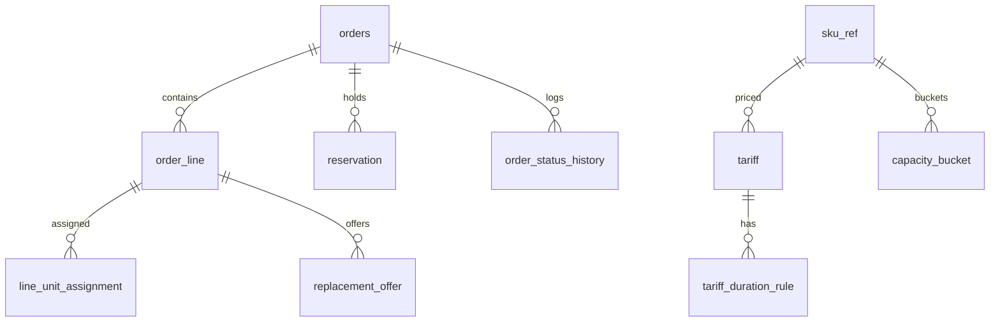
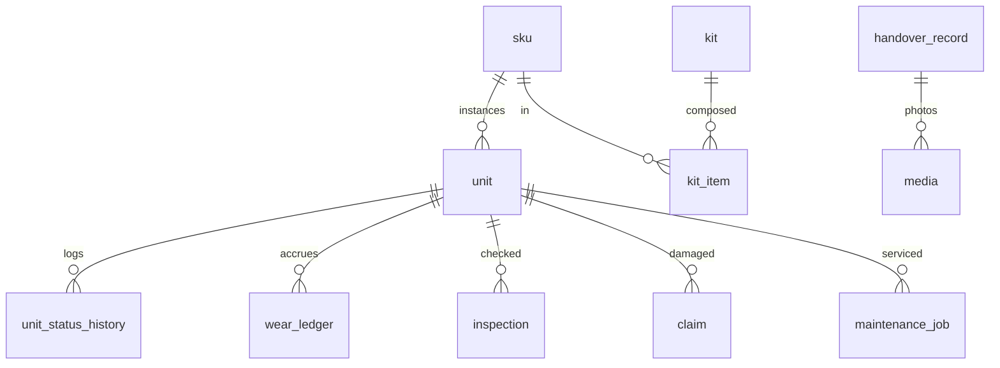

# Smart Rent Hub — SDD, Приложение A: модель данных

**Основание:** SDD v1.1, раздел 5; PRD v3.1.
**Состав:** DDL ключевых таблиц по сервисам (PostgreSQL), ER-диаграммы Booking и Inventory, правила индексов и миграций.
Это ориентир для Liquibase-миграций: типы и ограничения обязательны, второстепенные поля и индексы уточняются при реализации.

## A.0. Общие правила

- Первичные ключи — `uuid` (UUIDv7, генерируются в приложении).
- Время — `timestamptz` (UTC). Даты суточной ёмкости — `date` в `Europe/Moscow`.
- Деньги — `numeric(12,2)`, валюта RUB.
- Перечисления — `text` с `CHECK` (проще эволюция, чем enum-тип PostgreSQL).
- В каждой БД: таблицы `outbox`, `processed_event`, `idempotency_key` (где есть REST-команды), `app_config` (где есть параметры `CFG`).
- Таблицы аудита и журналы — только `INSERT`; права на `UPDATE/DELETE` для пользователя приложения отозваны.
- Мягкое удаление не используется; архивирование — отдельной политикой хранения.

### Общие таблицы (создаются в каждой БД)

```sql
CREATE TABLE outbox (
  id             uuid PRIMARY KEY,
  aggregate_type text        NOT NULL,            -- имя топика, например booking.order.v1
  aggregate_id   text        NOT NULL,            -- ключ партиции
  event_type     text        NOT NULL,
  schema_version int         NOT NULL DEFAULT 1,
  correlation_id text,
  traceparent    text,
  occurred_at    timestamptz NOT NULL DEFAULT now(),
  payload        jsonb       NOT NULL,            -- JSON события (Debezium разворачивает в сообщение)
  created_at     timestamptz NOT NULL DEFAULT now()
);
-- строка удаляется той же транзакцией, что и вставка (Debezium читает вставку из WAL);
-- event_type, schema_version, correlation_id, traceparent, occurred_at уходят в заголовки Kafka

CREATE TABLE processed_event (
  consumer     text        NOT NULL,
  event_id     uuid        NOT NULL,
  processed_at timestamptz NOT NULL DEFAULT now(),
  PRIMARY KEY (consumer, event_id)
);

CREATE TABLE idempotency_key (
  key          text        PRIMARY KEY,
  request_hash text        NOT NULL,
  response     jsonb,
  status       text        NOT NULL CHECK (status IN ('IN_PROGRESS','DONE')),
  created_at   timestamptz NOT NULL DEFAULT now()
);

CREATE TABLE app_config (
  key        text        PRIMARY KEY,
  value      jsonb       NOT NULL,
  version    bigint      NOT NULL DEFAULT 1,
  updated_by text        NOT NULL,
  updated_at timestamptz NOT NULL DEFAULT now()
);
```

---

## A.1. БД `booking`

### Каталожные проекции и тарифы

```sql
CREATE TABLE sku_ref (
  sku_id              uuid PRIMARY KEY,
  category_id         uuid        NOT NULL,
  name                text        NOT NULL,
  replacement_value   numeric(12,2) NOT NULL,
  same_day_turnaround boolean     NOT NULL DEFAULT false,
  updated_at          timestamptz NOT NULL
);

CREATE TABLE tariff (
  tariff_id      uuid PRIMARY KEY,
  sku_id         uuid,
  category_id    uuid,
  version        int           NOT NULL,
  base_rate      numeric(12,2) NOT NULL,
  fee_percent    numeric(5,2)  NOT NULL,             -- плата за защиту
  grade_b_discount numeric(5,2) NOT NULL DEFAULT 15,
  surge_threshold  numeric(5,2) NOT NULL DEFAULT 80,
  surge_markup     numeric(5,2) NOT NULL DEFAULT 30,
  max_multiplier   numeric(4,2) NOT NULL DEFAULT 1.5,
  floor_price      numeric(12,2),                    -- экономический пол (из Finance)
  effective_from   timestamptz   NOT NULL,
  created_by       text          NOT NULL,
  CHECK (sku_id IS NOT NULL OR category_id IS NOT NULL),
  UNIQUE (sku_id, category_id, version)
);

CREATE TABLE tariff_duration_rule (
  tariff_id uuid NOT NULL REFERENCES tariff,
  from_days int  NOT NULL,
  to_days   int,                                       -- NULL = без верхней границы
  coef      numeric(4,2) NOT NULL,
  PRIMARY KEY (tariff_id, from_days)
);
```

### Ёмкость и резервы

```sql
CREATE TABLE serviceable_units (               -- проекция из Inventory
  sku_id         uuid   NOT NULL,
  grade          char(1) NOT NULL CHECK (grade IN ('A','B')),
  units          int    NOT NULL CHECK (units >= 0),
  source_version bigint NOT NULL,
  updated_at     timestamptz NOT NULL,
  PRIMARY KEY (sku_id, grade)
);

CREATE TABLE capacity_bucket (
  sku_id         uuid    NOT NULL,
  grade          char(1) NOT NULL CHECK (grade IN ('A','B')),
  day            date    NOT NULL,
  category_id    uuid    NOT NULL,                 -- для расчёта загрузки категории
  total_units    int     NOT NULL CHECK (total_units >= 0),
  reserved_units int     NOT NULL DEFAULT 0 CHECK (reserved_units >= 0),
  PRIMARY KEY (sku_id, grade, day)
  -- CHECK (reserved_units <= total_units) намеренно отсутствует (SDD 8.1)
);
CREATE INDEX capacity_bucket_category_day ON capacity_bucket (category_id, day);

CREATE TABLE reservation (
  reservation_id uuid PRIMARY KEY,
  order_id       uuid    NOT NULL,
  line_id        uuid    NOT NULL,
  sku_id         uuid    NOT NULL,
  grade          char(1) NOT NULL,
  from_day       date    NOT NULL,
  to_day         date    NOT NULL,
  qty            int     NOT NULL CHECK (qty > 0),
  status         text    NOT NULL CHECK (status IN ('HELD','CONFIRMED','RELEASED')),
  expires_at     timestamptz,                      -- для HELD
  created_at     timestamptz NOT NULL DEFAULT now(),
  CHECK (to_day >= from_day)
);
CREATE INDEX reservation_held_expiry ON reservation (expires_at) WHERE status = 'HELD';
CREATE INDEX reservation_order ON reservation (order_id);
```

### Заказы

```sql
CREATE TABLE orders (
  order_id            uuid PRIMARY KEY,
  customer_id         uuid          NOT NULL,
  status              text          NOT NULL CHECK (status IN (
    'DRAFT','PENDING_PAYMENT','PENDING_REVIEW','RESERVED','ACTIVE','OVERDUE',
    'RETURNED','COMPLETED','DISPUTED','CANCELLED','EXPIRED','NO_SHOW')),
  risk_tier           text          CHECK (risk_tier IN ('LOW','MEDIUM','HIGH')),
  checkout_step       text          CHECK (checkout_step IN ('RISK','IDENTITY','PAYMENT','REVIEW','CONFIRMING')),  -- подстатус оформления для UI
  tav                 numeric(12,2),
  pickup_slot_start   timestamptz,
  return_deadline     timestamptz,
  total_rent          numeric(12,2),
  protection_fee      numeric(12,2),
  hold_amount         numeric(12,2),
  bonus_applied       numeric(12,2) NOT NULL DEFAULT 0,
  price_snapshot      jsonb,
  process_instance_id text,                         -- ссылка на экземпляр процесса checkout
  version             bigint        NOT NULL DEFAULT 0,
  created_at          timestamptz   NOT NULL DEFAULT now(),
  updated_at          timestamptz   NOT NULL DEFAULT now()
);
CREATE INDEX orders_customer ON orders (customer_id, created_at DESC);
CREATE INDEX orders_status_pickup ON orders (status, pickup_slot_start);

CREATE TABLE order_line (
  line_id     uuid PRIMARY KEY,
  order_id    uuid    NOT NULL REFERENCES orders,
  sku_id      uuid    NOT NULL,
  grade       char(1) NOT NULL,
  qty         int     NOT NULL CHECK (qty > 0),
  status      text    NOT NULL CHECK (status IN (
    'RESERVED','ASSIGNED','ISSUED','RETURNED','INSPECTED_OK','DAMAGED','LOST')),
  line_price  numeric(12,2) NOT NULL
);

CREATE TABLE line_unit_assignment (
  line_id     uuid NOT NULL REFERENCES order_line,
  unit_id     uuid NOT NULL,
  assigned_at timestamptz NOT NULL DEFAULT now(),
  PRIMARY KEY (line_id, unit_id)
);

CREATE TABLE order_status_history (
  id                     bigserial PRIMARY KEY,
  order_id               uuid NOT NULL,
  from_status            text,
  to_status              text NOT NULL,
  actor                  text NOT NULL,             -- user id или service account
  acted_under_permission text,
  reason                 text,
  at                     timestamptz NOT NULL DEFAULT now()
);

CREATE TABLE replacement_offer (
  offer_id         uuid PRIMARY KEY,
  order_id         uuid    NOT NULL,
  line_id          uuid    NOT NULL,
  step             int     NOT NULL CHECK (step BETWEEN 1 AND 4),
  offered_sku_id   uuid,
  offered_grade    char(1),
  surcharge        numeric(12,2) NOT NULL DEFAULT 0,
  status           text NOT NULL CHECK (status IN ('OFFERED','ACCEPTED','DECLINED','EXPIRED')),
  expires_at       timestamptz NOT NULL
);

CREATE TABLE bonus_credit (
  credit_id       uuid PRIMARY KEY,
  customer_id     uuid NOT NULL,
  source_order_id uuid NOT NULL,
  amount          numeric(12,2) NOT NULL,
  status          text NOT NULL CHECK (status IN ('ACTIVE','USED','EXPIRED')),
  expires_at      timestamptz NOT NULL
);
```

Схема `bpm` создаётся и обслуживается движком Operaton (Liquibase-миграции приложения её не трогают, `schema-update` управляется движком).

### ER-диаграмма Booking



---

## A.2. БД `inventory`

```sql
CREATE TABLE sku (
  sku_id              uuid PRIMARY KEY,
  category_id         uuid         NOT NULL,
  brand               text         NOT NULL,
  model               text         NOT NULL,
  name                text         NOT NULL,
  description         text,
  attributes          jsonb        NOT NULL DEFAULT '{}',
  replacement_value   numeric(12,2) NOT NULL,
  same_day_turnaround boolean      NOT NULL DEFAULT false,
  expected_life_wear_days int,
  residual_value_percent  numeric(5,2),
  repair_rate_per_wear_day numeric(10,2),
  version             bigint       NOT NULL DEFAULT 0,       -- @Version
  updated_at          timestamptz  NOT NULL DEFAULT now()
);

CREATE TABLE unit (
  unit_id              uuid PRIMARY KEY,
  sku_id               uuid        NOT NULL REFERENCES sku,
  serial_number        text        NOT NULL UNIQUE,
  status               text        NOT NULL CHECK (status IN (
    'AVAILABLE','ASSIGNED','IN_USE','RETURNED_PENDING_INSPECTION',
    'MAINTENANCE','IN_REPAIR','DECOMMISSIONED','LOST')),
  maintenance_kind     text        CHECK (maintenance_kind IN ('ROUTINE_CLEANING','TECHNICAL_SERVICE')),
  grade                char(1)     NOT NULL DEFAULT 'A' CHECK (grade IN ('A','B')),
  assigned_order_id    uuid,
  total_wear_days      numeric(8,1) NOT NULL DEFAULT 0,
  service_wear_days    numeric(8,1) NOT NULL DEFAULT 0,
  acquisition_cost     numeric(12,2) NOT NULL,
  acquisition_date     date        NOT NULL,
  residual_value_percent numeric(5,2) NOT NULL,
  expected_life_wear_days int      NOT NULL,
  version              bigint      NOT NULL DEFAULT 0,       -- @Version
  updated_at           timestamptz NOT NULL DEFAULT now(),
  CHECK ((status = 'MAINTENANCE') = (maintenance_kind IS NOT NULL))
);
CREATE INDEX unit_pick ON unit (sku_id, grade, status, total_wear_days);

CREATE TABLE unit_status_history (
  id                     bigserial PRIMARY KEY,
  unit_id                uuid NOT NULL,
  from_status            text,
  to_status              text NOT NULL,
  actor                  text NOT NULL,
  acted_under_permission text,
  reason                 text,
  at                     timestamptz NOT NULL DEFAULT now()
);

CREATE TABLE wear_ledger (
  wear_id       uuid PRIMARY KEY,
  order_id      uuid        NOT NULL,
  unit_id       uuid        NOT NULL,
  actual_days   numeric(6,1) NOT NULL,
  coefficient   numeric(3,1) NOT NULL,
  wear_days     numeric(6,1) NOT NULL,
  created_at    timestamptz NOT NULL DEFAULT now(),
  UNIQUE (order_id, unit_id)                          -- начисление ровно один раз
);

CREATE TABLE kit (
  kit_id uuid PRIMARY KEY, name text NOT NULL, version bigint NOT NULL DEFAULT 0
);
CREATE TABLE kit_item (
  kit_id uuid NOT NULL REFERENCES kit, sku_id uuid NOT NULL REFERENCES sku,
  qty int NOT NULL CHECK (qty > 0), mandatory boolean NOT NULL DEFAULT true,
  PRIMARY KEY (kit_id, sku_id)
);

CREATE TABLE consumable_stock (
  sku_id uuid PRIMARY KEY REFERENCES sku,
  on_hand int NOT NULL CHECK (on_hand >= 0),
  version bigint NOT NULL DEFAULT 0
);

CREATE TABLE handover_record (
  handover_id      uuid PRIMARY KEY,
  order_id         uuid        NOT NULL,
  type             text        NOT NULL CHECK (type IN ('HANDOVER','RETURN')),
  checklist        jsonb       NOT NULL,
  identity_checked boolean     NOT NULL,                -- результат проверки, без скана
  performed_by     text        NOT NULL,
  customer_signed_at timestamptz,
  act_object_key   text,
  created_at       timestamptz NOT NULL DEFAULT now()
);

CREATE TABLE media (
  media_id     uuid PRIMARY KEY,
  owner_type   text NOT NULL CHECK (owner_type IN ('UNIT','HANDOVER','DEFECT','SKU')),
  owner_id     uuid NOT NULL,
  object_key   text NOT NULL,
  sha256       text NOT NULL,
  created_at   timestamptz NOT NULL DEFAULT now()
);

CREATE TABLE inspection (
  inspection_id uuid PRIMARY KEY,
  order_id      uuid NOT NULL,
  unit_id       uuid NOT NULL,
  result        text NOT NULL CHECK (result IN ('OK','DEFECT')),
  started_at    timestamptz NOT NULL,
  finished_at   timestamptz,
  performed_by  text NOT NULL,
  overdue_flag  boolean NOT NULL DEFAULT false
);

CREATE TABLE claim (
  claim_id        uuid PRIMARY KEY,
  order_id        uuid NOT NULL,
  unit_id         uuid NOT NULL,
  status          text NOT NULL CHECK (status IN (
    'OPENED','ASSESSED','CLIENT_RESPONSE','RESOLVED')),
  assessment      numeric(12,2),
  franchise       numeric(12,2),
  claim_amount    numeric(12,2),
  protection_plan boolean NOT NULL,
  resolved_by     text,
  response_due_at timestamptz,
  version         bigint NOT NULL DEFAULT 0
);

CREATE TABLE maintenance_job (
  job_id      uuid PRIMARY KEY,
  unit_id     uuid NOT NULL,
  kind        text NOT NULL CHECK (kind IN ('ROUTINE_CLEANING','TECHNICAL_SERVICE','REPAIR')),
  verdict     text,
  cost        numeric(12,2),
  started_at  timestamptz NOT NULL,
  finished_at timestamptz
);

CREATE TABLE pickup_config (
  id            int PRIMARY KEY DEFAULT 1 CHECK (id = 1),
  work_start    time NOT NULL,
  work_end      time NOT NULL,
  slot_minutes  int  NOT NULL,
  slot_capacity int  NOT NULL,
  holidays      date[] NOT NULL DEFAULT '{}'
);

CREATE TABLE approval_request (
  request_id    uuid PRIMARY KEY,
  action        text NOT NULL,
  subject_id    uuid NOT NULL,
  requested_by  text NOT NULL,
  mode          text NOT NULL CHECK (mode IN ('SECOND_APPROVER','LOG_ONLY')),
  status        text NOT NULL CHECK (status IN ('PENDING','GRANTED','REJECTED','EXPIRED')),
  decided_by    text,
  comment       text,
  created_at    timestamptz NOT NULL DEFAULT now()
);
```

Таблица `approval_request` в одинаковой структуре есть в каждом сервисе-владельце чувствительных действий (Inventory, Payments, Risk, Booking).

### ER-диаграмма Inventory



---

## A.3. БД `payments`

```sql
CREATE TABLE payment_method (
  method_id   uuid PRIMARY KEY,
  customer_id uuid NOT NULL,
  token       text NOT NULL,
  last4       char(4) NOT NULL,
  brand       text,
  created_at  timestamptz NOT NULL DEFAULT now()
);

CREATE TABLE hold (
  hold_id          uuid PRIMARY KEY,
  order_id         uuid NOT NULL,
  method_id        uuid NOT NULL REFERENCES payment_method,
  amount           numeric(12,2) NOT NULL,
  status           text NOT NULL CHECK (status IN (
    'AUTHORIZED','REQUIRES_ACTION','CAPTURED_PARTIAL','RELEASED','EXPIRED','DECLINED')),
  provider_ref     text,
  idempotency_key  text NOT NULL UNIQUE,
  expires_at       timestamptz,
  reauth_due_at    timestamptz,
  created_at       timestamptz NOT NULL DEFAULT now()
);

CREATE TABLE payment (
  payment_id       uuid PRIMARY KEY,
  order_id         uuid NOT NULL,
  type             text NOT NULL CHECK (type IN ('CHARGE','CAPTURE','REFUND')),
  amount           numeric(12,2) NOT NULL,
  status           text NOT NULL CHECK (status IN ('PENDING','SUCCEEDED','FAILED','UNKNOWN')),
  provider_ref     text,
  purpose          text NOT NULL CHECK (purpose IN (
    'RENT','PROTECTION','PENALTY','CLAIM','SURCHARGE','REFUND_CANCEL','REFUND_COMPENSATION')),
  idempotency_key  text NOT NULL UNIQUE,
  fiscal_status    text NOT NULL DEFAULT 'NOT_REQUIRED'
                   CHECK (fiscal_status IN ('NOT_REQUIRED','PENDING','DONE','FAILED')),
  created_at       timestamptz NOT NULL DEFAULT now()
);

CREATE TABLE debt (
  debt_id     uuid PRIMARY KEY,
  order_id    uuid NOT NULL,
  customer_id uuid NOT NULL,
  amount      numeric(12,2) NOT NULL,
  status      text NOT NULL CHECK (status IN ('OPEN','PARTIALLY_PAID','CLOSED','WRITTEN_OFF')),
  created_at  timestamptz NOT NULL DEFAULT now()
);
```

---

## A.4. БД `risk`

```sql
CREATE TABLE customer_profile (
  customer_id      uuid PRIMARY KEY,
  trust_level      text NOT NULL DEFAULT 'L0' CHECK (trust_level IN ('L0','L1','L2','L3')),
  clean_rentals    int  NOT NULL DEFAULT 0,
  penalty_until    timestamptz,
  blacklisted      boolean NOT NULL DEFAULT false,
  version          bigint NOT NULL DEFAULT 0,
  updated_at       timestamptz NOT NULL DEFAULT now()
);

CREATE TABLE risk_assessment (
  assessment_id  uuid PRIMARY KEY,
  order_id       uuid NOT NULL,
  customer_id    uuid NOT NULL,
  tav            numeric(12,2) NOT NULL,
  duration_days  int NOT NULL,
  tier           text NOT NULL CHECK (tier IN ('LOW','MEDIUM','HIGH')),
  required_checks jsonb NOT NULL,
  hold_policy    jsonb NOT NULL,
  protection_required boolean NOT NULL,
  created_at     timestamptz NOT NULL DEFAULT now()
);

CREATE TABLE identity_verification (
  verification_id uuid PRIMARY KEY,
  customer_id     uuid NOT NULL,
  provider        text NOT NULL,
  level           text NOT NULL CHECK (level IN ('BANK_ID','ESIA')),
  status          text NOT NULL CHECK (status IN ('PENDING','VERIFIED','FAILED')),
  verified_at     timestamptz                      -- ПДн и сканы не хранятся
);

CREATE TABLE review_task (
  review_id    uuid PRIMARY KEY,
  order_id     uuid NOT NULL,
  status       text NOT NULL CHECK (status IN ('OPEN','APPROVED','REJECTED','ESCALATED')),
  due_at       timestamptz NOT NULL,
  decided_by   text,
  decision_comment text,
  created_at   timestamptz NOT NULL DEFAULT now()
);

CREATE TABLE blacklist_entry (
  entry_id     uuid PRIMARY KEY,
  customer_id  uuid NOT NULL,
  reason       text NOT NULL,
  status       text NOT NULL CHECK (status IN ('PROPOSED','ACTIVE','LIFTED')),
  proposed_by  text NOT NULL,
  approved_by  text,
  created_at   timestamptz NOT NULL DEFAULT now()
);
```

---

## A.5. БД `notification`

```sql
CREATE TABLE notification (
  notification_id uuid PRIMARY KEY,
  user_id         uuid NOT NULL,
  channel         text NOT NULL CHECK (channel IN ('SMS','EMAIL','WEB')),
  template        text NOT NULL,
  params          jsonb NOT NULL,
  status          text NOT NULL CHECK (status IN ('PENDING','SENT','FAILED')),
  attempts        int NOT NULL DEFAULT 0,
  created_at      timestamptz NOT NULL DEFAULT now()
);

CREATE TABLE staff_task (
  task_id             uuid PRIMARY KEY,
  type                text NOT NULL,           -- PICKUP, REVIEW, ESCALATION, APPROVAL
  ref_type            text NOT NULL,
  ref_id              uuid NOT NULL,
  required_permission text NOT NULL,
  status              text NOT NULL CHECK (status IN ('OPEN','TAKEN','DONE','CANCELLED')),
  taken_by            text,
  seq                 bigserial,               -- для дозаполнения по lastEventId
  created_at          timestamptz NOT NULL DEFAULT now()
);
CREATE INDEX staff_task_open ON staff_task (required_permission, status);
```

---

## A.6. БД `ai`

```sql
CREATE TABLE sku_attr_ref (                      -- проекция из inventory.sku.v1
  sku_id      uuid PRIMARY KEY,
  category_id uuid NOT NULL,
  name        text NOT NULL,
  attributes  jsonb NOT NULL                     -- mount, power, connector, sync и др.
);

CREATE TABLE compat_rule (
  rule_id      uuid PRIMARY KEY,
  category_a   uuid NOT NULL,
  category_b   uuid NOT NULL,
  constraint_def jsonb NOT NULL,                 -- например {"a.mount":"==b.mount"}
  severity     text NOT NULL CHECK (severity IN ('BLOCK','WARN')),
  explanation  text NOT NULL,
  version      bigint NOT NULL DEFAULT 0
);

CREATE TABLE compat_edge (                       -- явные аксессуарные связи
  sku_a    uuid NOT NULL,
  sku_b    uuid NOT NULL,
  relation text NOT NULL CHECK (relation IN ('REQUIRES','RECOMMENDS','INCOMPATIBLE')),
  PRIMARY KEY (sku_a, sku_b, relation)
);

CREATE TABLE ai_request_log (                    -- без текста запросов с ПДн
  request_id   uuid PRIMARY KEY,
  session_id   uuid NOT NULL,
  duration_ms  int  NOT NULL,
  llm_fallback boolean NOT NULL,
  substitutions int NOT NULL,
  created_at   timestamptz NOT NULL DEFAULT now()
);
```

---

## A.7. БД `finance`

```sql
CREATE TABLE unit_asset (
  unit_id                 uuid PRIMARY KEY,
  sku_id                  uuid NOT NULL,
  acquisition_cost        numeric(12,2) NOT NULL,
  acquisition_date        date NOT NULL,
  residual_value_percent  numeric(5,2) NOT NULL,
  expected_life_wear_days int NOT NULL,
  accumulated_amortization numeric(12,2) NOT NULL DEFAULT 0,
  status                  text NOT NULL CHECK (status IN ('ACTIVE','DISPOSED'))
);

CREATE TABLE fund_ledger_entry (
  entry_id        uuid PRIMARY KEY,
  fund            text NOT NULL CHECK (fund IN ('F1','F2','F3')),
  direction       text NOT NULL CHECK (direction IN ('ACCRUAL','WRITE_OFF')),
  amount          numeric(12,2) NOT NULL,
  unit_id         uuid,
  sku_id          uuid,
  order_id        uuid,
  source_event_id uuid NOT NULL,
  reason          text NOT NULL,
  period          date NOT NULL,                   -- первый день месяца
  created_at      timestamptz NOT NULL DEFAULT now(),
  UNIQUE (source_event_id, fund, reason)           -- идемпотентность
);

CREATE TABLE period_close (
  period     date PRIMARY KEY,
  closed_at  timestamptz NOT NULL,
  closed_by  text NOT NULL
);
```

---

## A.8. Индекс Elasticsearch `sku-v1` (набросок)

```json
{
  "settings": {
    "analysis": {
      "char_filter": {
        "ru_to_lat": { "type": "icu_transform", "id": "Cyrillic-Latin" }
      },
      "filter": {
        "srh_synonyms": { "type": "synonym_graph", "synonyms_set": "srh-synonyms" },
        "ru_stop": { "type": "stop", "stopwords": "_russian_" },
        "ru_stemmer": { "type": "stemmer", "language": "russian" },
        "edge": { "type": "edge_ngram", "min_gram": 2, "max_gram": 15 }
      },
      "analyzer": {
        "ru_morph": { "tokenizer": "standard", "filter": ["lowercase", "ru_stop", "ru_stemmer"] },
        "translit": { "tokenizer": "standard", "char_filter": ["ru_to_lat"], "filter": ["lowercase", "srh_synonyms"] },
        "suggest": { "tokenizer": "standard", "filter": ["lowercase", "edge"] }
      }
    }
  },
  "mappings": {
    "properties": {
      "sku_id": { "type": "keyword" },
      "name": { "type": "text", "analyzer": "ru_morph",
        "fields": { "translit": { "type": "text", "analyzer": "translit" },
                    "suggest": { "type": "text", "analyzer": "suggest" } } },
      "brand": { "type": "text", "fields": { "raw": { "type": "keyword" } } },
      "model": { "type": "text", "analyzer": "translit" },
      "category_path": { "type": "keyword" },
      "attributes": { "type": "flattened" },
      "price_from": { "type": "scaled_float", "scaling_factor": 100 },
      "updated_at": { "type": "date" }
    }
  }
}
```

Требуется плагин ICU (`analysis-icu`). Набор синонимов хранится как synonyms set и обновляется через API Elasticsearch из REST-эндпоинта `search`. Параметры анализаторов уточняются на этапе 3.

---

## A.9. Правила миграций

- Liquibase, один changelog на сервис, форматы `yaml` или `xml`, имена `NNN-описание`.
- Совместимость «расширить → мигрировать → сузить»: изменения схемы обратно-совместимы в пределах одного релиза (чтобы старая и новая версии сервиса работали параллельно при rolling update).
- Миграции данных — отдельными changeset, идемпотентными.
- Тестовые данные (seed) — отдельный контекст Liquibase `seed`, не выполняется в stage и далее.
- Пользователи БД: владелец схемы (миграции) отделён от пользователя приложения (DML без DDL).
